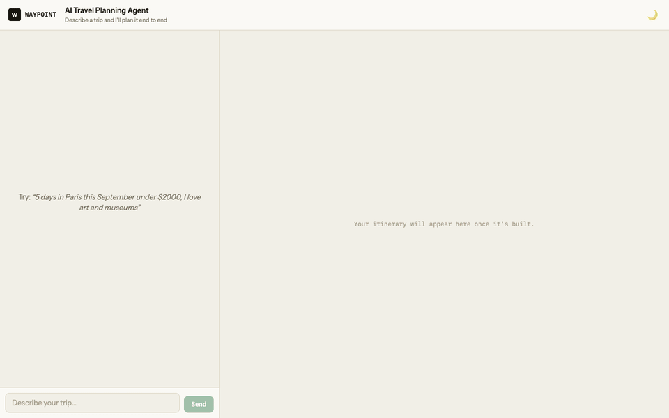
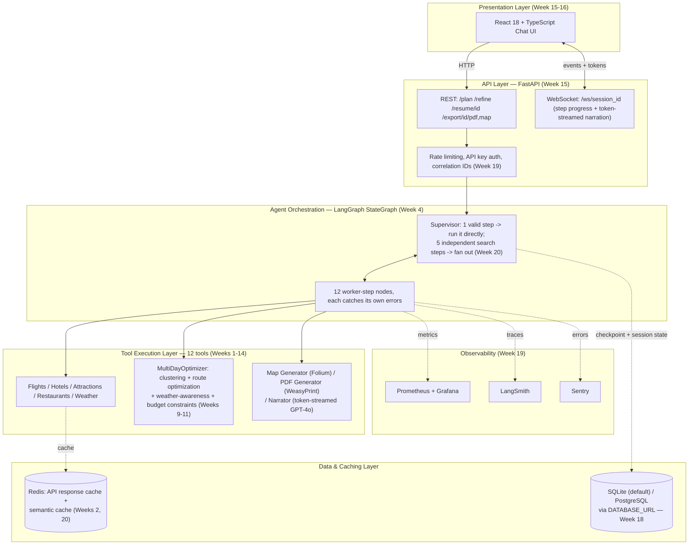
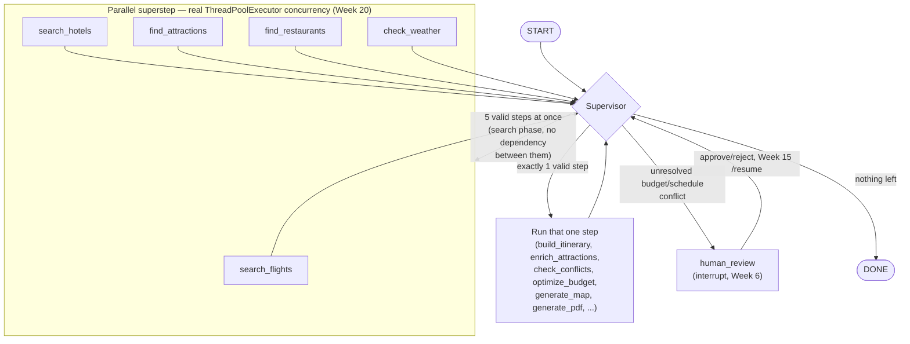

# Autonomous AI Travel Planning Agent

End-to-end agentic system for personalized trip planning, itinerary building, and logistics.
Built over a 24-week plan (see [`docs/PROJECT_PLAN.md`](docs/PROJECT_PLAN.md)); this repo
tracks progress phase by phase.

**Quick links:** [Architecture](#architecture) ·
[Setup](#setup) · [Evaluation report](docs/EVALUATION_REPORT.md) ·
[Architecture Decision Records](docs/adr/) ·
[Blog post](docs/BLOG_POST.md) · [Resume bullets](docs/RESUME_BULLETS.md)



_Real, unscripted capture (Week 23) of a live session against the actual
running backend and real APIs — not a mockup. See it happen: a request is
typed and sent, the step-progress checklist ticks off search steps
(several in parallel — Week 20), and the finished trip is reviewed across
the Itinerary/Map/PDF tabs, including the real GPT-4o narration and
refinement chips._

## Architecture

Six layers, matching the plan's own system-architecture overview (see
`docs/PROJECT_PLAN.md` §2.2) — a request enters through the presentation
layer, is orchestrated by a LangGraph supervisor loop, executes through 12
independent tools backed by 8 real external APIs, persists through a
caching/storage layer that degrades gracefully without real infra, and is
observed end-to-end:



The agent loop itself (what "Orchestration" above actually does each turn) —
a supervisor picks the next step, worker nodes route back to the
supervisor, and repeat until every step is exhausted:



Full per-week rationale for every non-obvious choice above (LangGraph over a
plain loop, real ThreadPoolExecutor fan-out over `asyncio.gather`, SQLite
default with Postgres opt-in, ...) is in [`docs/adr/`](docs/adr/); the
`## Status` log below is the single source of truth for exactly what
shipped each week, in order.

## Status

**Phase 1, Week 1 — Project Scaffold, Environment & API Setup** — done

- [x] Repo scaffold, Poetry project, pre-commit (black, ruff)
- [x] Core Pydantic data models (`TravelPreferences`, `FlightOption`, `HotelOption`,
      `Attraction`, `Restaurant`, `Itinerary`, ...)
- [x] `PreferenceParser` v1 (GPT-4o via LangChain structured output)
- [x] Unit tests for `PreferenceParser` and core models
- [x] All 7 external APIs registered and smoke-tested (`make smoke`)

**Phase 1, Week 2 — Flight Search & Hotel Search Tools** — done

- [x] `FlightSearchTool` (TravelPayouts: merges `/v1/prices/cheap` + `/v2/prices/latest`)
- [x] `HotelSearchTool` (Booking.com via RapidAPI: destination lookup + hotel search)
- [x] Redis-backed response caching (`utils/cache.py`), graceful no-op if Redis is down
- [x] Retry/backoff on transient errors; deterministic mock-data fallback (`is_mock_data` flag)
- [x] 26 unit tests across both tools (mocked HTTP via `responses`), plus 6 for the cache layer

**Phase 1, Week 3 — Attraction, Restaurant & Weather Tools** — done

- [x] `AttractionFinderTool` and `RestaurantFinderTool` (both via Serper's `/places`
      endpoint, which returns structured name/lat/lng/rating/category/price directly —
      no separate OpenStreetMap or Google Places calls needed)
- [x] `WeatherCheckerTool` (OpenWeatherMap geocode + free-tier 5-day/3-hour forecast,
      aggregated into one `WeatherForecast` per day with a derived comfort score)
- [x] `BudgetTrackerTool` (pure computation: per-category running tally, remaining budget)
- [x] Shared `utils/http.py` retry/timeout helper, used by all three new HTTP-backed tools
- [x] 46 new unit tests + 1 integration test simulating a full 5-day London trip across
      all four tools together

**Phase 1, Week 4 — LangGraph State Machine & Tool Orchestration** — done

- [x] Typed `PlanningState` + `determine_valid_steps`: encodes hard dependencies
      (preferences must exist before any search; flights need an origin; weather
      needs a start date) as code, not something the LLM has to infer
- [x] `SupervisorAgent`: skips the LLM entirely when only one step is valid; calls
      it (with structured output, validated against the allowed set) only when
      multiple independent tools are all ready and an order must be chosen
- [x] All 6 tools wired into StateGraph nodes, each catching its own exceptions
      into `errors` so one tool failing doesn't halt the run
- [x] SQLite-backed checkpointer (`langgraph-checkpoint-sqlite`) — verified state
      persists and is retrievable across a fresh connection using just a `thread_id`
- [x] End-to-end smoke test: real natural-language input → all 6 tools called → full
      itinerary-ready state assembled, live against all real APIs
- [x] 34 new unit/integration tests (state routing, supervisor, each node, and the
      full compiled graph with stubbed tools)

**Phase 2, Week 5 — Itinerary Builder v1: Time Slot Assignment** — done

- [x] `ItineraryBuilder`: arrival day (flight → transfer → check-in → dinner if time
      allows), full middle days (morning/lunch/afternoon/dinner), departure day
      (checkout → airport transfer)
- [x] `TravelTimeEstimator`: real Google Distance Matrix lookups between consecutive
      activities, cached, with a flat-minute fallback on any failure
- [x] Fixed, category-appropriate time windows stand in for real opening-hours data
      (neither Serper nor Booking.com actually supply it); travel time can push a
      booking later within its window or skip it entirely if it can't fit
- [x] Caught and fixed a real bug during live testing: TravelPayouts returns the
      cheapest fare found *near* the requested month, not on the exact date, so the
      builder was anchoring Day 1 to the flight's own (wrong) date. Fixed by using
      only the flight's time-of-day, anchored to the itinerary's actual start date
- [x] Wired into the LangGraph as a final `build_itinerary` step, run once every
      search tool has completed
- [x] Live-tested end-to-end against all 3 required trip types (city tour, beach
      holiday, adventure trip) plus 25 new unit tests

**Phase 2, Week 6 — Conflict Detection & Resolution** — done

- [x] `ConflictDetector`: five constraint types — overlapping items, physically
      impossible travel gaps (real Distance Matrix lookups), budget overruns,
      too many activities per day, and restaurants outside normal meal hours
- [x] `ConflictResolver`: shifts times, drops the lowest-priority activity, or
      trims the most expensive optional items until back under budget. Returns
      unresolved only when fixed costs (flights, hotel) alone exceed the budget
- [x] `detect_and_resolve`: bounded iterative loop — live-testing showed that
      fixing one conflict can surface another (a meal-time fix can create a new
      impossible-travel gap), so a single detect→resolve pass isn't enough
- [x] Human-in-the-loop `human_review` step using LangGraph's real `interrupt()`/
      `Command(resume=...)` API: the graph genuinely pauses (verified via a live
      forced-unresolvable-budget scenario) and resumes correctly on approval or
      rejection
- [x] Every resolution attempt, successful or not, is logged (`ResolutionLogEntry`)
      for later evaluation analysis
- [x] 47 new tests (20 detector scenarios, 13 resolver scenarios including the
      cascading-conflict case, plus node-level and full-graph human-in-the-loop
      integration tests)

**Phase 2, Week 7 — Weather-Aware Scheduling** — done

- [x] `weather_matcher.py`: keyword-based indoor/outdoor classifier for attractions
      (no data source we use tags this explicitly), a bad-weather check (high rain
      probability or low comfort score), and the `weather_adaptation_rate` metric
- [x] `ItineraryBuilder` now prefers outdoor attractions on good-weather days and
      indoor ones (museums, galleries) on bad-weather days, falling back to the
      original rating-sorted order when there's no forecast or no clear match
- [x] Narrative warnings per day (`DayPlan.warnings`) — "Pack rain gear", heat/cold/
      wind alerts — surfaced from the same forecast used for scheduling
- [x] Found and fixed a real Week 5 bug while reworking the attraction-picking
      logic: the day-index arithmetic for the first full day started at 1 instead
      of 0, so the top one or two highest-rated attractions were silently never
      scheduled in any itinerary
- [x] A/B test script (`scripts/weather_ab_test.py`) across 10 real destinations
      with a controlled good/bad weather pattern: weather-aware scheduling hit
      100% adaptation rate on every destination vs. a 39% baseline average — a
      measured +61 point improvement
- [x] 27 new tests (weather_matcher classification/metric, weather-aware
      ItineraryBuilder scenarios including a regression test for the Week 5 bug,
      and node-level weather pass-through)

**Phase 2, Week 8 — Budget Optimization & Constraint Satisfaction** — done

- [x] `BudgetOptimizer`: flights are a market-price pass-through (not allocated a
      percentage); whatever budget remains after flights is split across hotel/
      food/activities using backpacker/mid-range/luxury tier defaults, shiftable
      by `TravelPreferences.priority_weights` (e.g. "I prioritize accommodation
      over dining")
- [x] Per-category evaluation against the actual built itinerary — upgrade
      suggestions when a category is well under its allocation, cut suggestions
      when it's over, using `itinerary_cost_breakdown` (new in `budget_tracker.py`)
- [x] `budget_adherence_score`: 1.0 for an exact match to the stated budget,
      decreasing symmetrically for both overspend and underspend
- [x] Wired into the LangGraph as an `optimize_budget` step, running after
      conflicts are resolved so the evaluation reflects the final itinerary
- [x] Live-verified tier splits, priority-weight shifting, and upgrade/cut
      suggestions against real search results across all three tiers
- [x] 20-scenario constraint satisfaction script (`scripts/budget_scenarios_test.py`)
      spanning tiers, priority weights, and budget levels from tight to generous
- [x] 39 new tests (budget_tracker breakdown/adherence, BudgetOptimizer allocation/
      evaluation, node-level, and updated graph-routing tests)

**Phase 3, Week 9 — Geospatial Data Pipeline** — done

- [x] Attractions/hotels already carry precise lat/lng directly from Serper/
      Booking.com (Weeks 2-3) — no separate geocoding/enrichment step was needed,
      since we'd chosen data sources that supply coordinates natively
- [x] `DistanceMatrixTool`: real NxN travel-time matrix via Google's batched
      Distance Matrix API — one request per origin (covering up to 100
      destinations each) instead of N² individual pairwise calls, chunked to
      respect Google's per-request element cap
- [x] Shares its Redis cache-key format with Week 5's single-pair
      `TravelTimeEstimator`, so pairs either tool has already computed are never
      re-fetched by the other
- [x] `geo_clustering.py`: DBSCAN clustering with a **haversine** metric (not
      Euclidean on raw degrees, which would distort east-west vs. north-south
      distances inconsistently across cities at different latitudes) — `eps` is
      expressed in real-world km
- [x] Folium map rendering, color-coded by cluster
- [x] Live-verified clustering quality on all 3 required cities (Paris, Tokyo,
      New York) via `scripts/geo_clustering_test.py`: geographically sensible
      results throughout (e.g. Paris's historic center clusters together while
      the Arc de Triomphe — genuinely ~2km further out — is correctly flagged as
      noise; NYC splits cleanly into a Financial District cluster and a Midtown
      cluster)
- [x] 20 new tests, including a haversine-scaling correctness check (verifies
      the km<->degree conversion isn't silently wrong)

**Phase 3, Week 10 — Route Optimization** — done

- [x] `RouteOptimizerTool`: Nearest Neighbor construction (greedy TSP
      approximation) followed by 2-opt local search, with the hotel as a fixed
      start/end point ("start near hotel, end near hotel")
- [x] Correctly handles **asymmetric** travel times (real driving/transit data
      reflects one-way streets and transit-line directionality, so A→B and B→A
      legitimately differ) — 2-opt recomputes the full tour length per candidate
      swap rather than taking the classic boundary-edges-only shortcut, which is
      only valid for symmetric distances. Verified with an adversarial regression
      test where the boundary-only shortcut would accept a swap that's actually
      far worse once a flipped internal edge is accounted for
- [x] `route_efficiency_score`: naive/optimized travel-time ratio, with the naive
      baseline averaged over multiple random shuffles rather than a single one
- [x] 20-scenario benchmark (`scripts/route_optimization_benchmark.py`, 5 real
      cities × 4 activity-set sizes) against a real Distance Matrix: **+45%
      average efficiency gain** over random ordering (range +10% to +92%,
      generally scaling up with more activities per day, as expected)
- [x] 19 new tests, including the asymmetric-matrix correctness regression and
      an invariant check that 2-opt never produces a worse tour than plain
      Nearest Neighbor across 20 randomized matrices

**Phase 3, Week 11 — Multi-Day Itinerary Optimizer** — done

- [x] `MultiDayOptimizer` sits above `ItineraryBuilder`: it decides WHICH
      attractions go on WHICH day (clustering + must-see priority + a bounded
      backtracking search against a per-day activity budget), route-optimizes
      each day's visiting order, and rebalances walking distance across days —
      then delegates the actual time-slot/weather-swap mechanics to a new
      `ItineraryBuilder.build_day()` public method, reusing the tested Week 5/7
      logic rather than duplicating it
- [x] Priority-based scheduling: `TravelPreferences.must_see` attractions are
      sorted first (by rating) ahead of "nice-to-have" ones, which are grouped
      by geographic cluster (largest cluster first) so nearby attractions tend
      to land on the same day
- [x] Real backtracking (not just greedy): candidate day-assignments are tried
      highest-priority-first; a combination that would push a day's estimated
      cost over its soft per-day activity budget (derived from Week 8's
      `BudgetOptimizer`) is rejected and the search backtracks to the next
      combination — undoing and retrying rather than committing to the first
      guess. Falls back to the cheapest available combination if none fit, so
      a day is never left empty
- [x] Cross-day balancing: after initial assignment, the day with the most
      total travel time and the day with the least repeatedly try swapping one
      attraction between them, keeping the swap only if it narrows the spread
- [x] A single batched Distance Matrix call (Week 9's `DistanceMatrixTool`,
      covering the hotel + every attraction that could be scheduled) backs
      every travel-time lookup used during assignment/balancing/ordering —
      found and fixed a real performance issue during live testing: an
      earlier version called the single-pair `TravelTimeEstimator` repeatedly
      during balancing/ordering, which on a cold cache meant dozens of
      redundant network round-trips
- [x] Performance: the optimizer's own computation (clustering, backtracking,
      route ordering, balancing) completes in single-digit milliseconds for a
      7-day/20-attraction trip, verified with fixed test doubles (no network
      involved) — comfortably inside the plan's <5s target. End-to-end wall
      time against real APIs is dominated by `ItineraryBuilder`'s per-item
      restaurant-transition Distance Matrix lookups (an existing Week 5
      characteristic, not part of Week 11's algorithm) and drops to
      milliseconds on a warm cache
- [x] Wired in as the LangGraph's default `build_itinerary` tool (same
      `.build()` signature as `ItineraryBuilder`, so it's a drop-in default;
      pass an explicit `ItineraryBuilder()` to opt out)
- [x] Live-tested via `scripts/multi_day_optimizer_benchmark.py` — 10 real
      trip scenarios across 5 cities, varying trip length/budget tier/must-see
      attractions: 100% must-see coverage across scenarios that specified one,
      46% average budget adherence (mock hotel pricing from Booking.com's
      exhausted RapidAPI quota skews this — see Week 2's known issue), 11
      minutes average day-to-day travel spread
- [x] 23 new tests: 19 for `MultiDayOptimizer` (must-see priority sorting,
      backtracking budget constraint satisfaction and graceful degradation,
      cross-day balancing, route ordering, batched-matrix call-count
      invariant, edge cases, and a performance regression test) plus 4 direct
      tests of the new `ItineraryBuilder.build_day()` entry point

**Phase 3, Week 12 — Agent Evaluation Framework** — done

- [x] 10-dimension rubric, split deliberately between what code can measure
      exactly and what genuinely needs judgment:
      - **6 computed** (`ItineraryEvaluator`, no LLM cost): `feasibility`
        (penalizes each `ConflictDetector` conflict), `budget_accuracy`
        (Week 8's `budget_adherence_score` × 10), `geo_efficiency` (the
        itinerary's as-scheduled route length vs. a naive-random baseline,
        same methodology as Week 10's `route_efficiency_score`),
        `weather_match` (Week 7's `weather_adaptation_rate` × 10),
        `completeness` (full-day slot-fill rate + must-see coverage), and
        `variety` (distinct attraction categories ÷ total scheduled)
      - **4 LLM-judged** (`ItineraryJudge`, GPT-4o — substituted for the
        plan's "Claude grades it" to stay on this project's one established
        LLM choice, the same kind of documented swap as TravelPayouts for
        Amadeus): `personalization_fit`, `narrative_quality`,
        `practicality`, `overall_satisfaction`
      - A dimension that doesn't apply (no budget stated, no weather data in
        range, fewer than 2 attractions scheduled) scores `None` and is
        excluded from that itinerary's overall average rather than dragging
        it down
- [x] `scripts/agent_evaluation.py`: 25 real trip scenarios across 13 cities,
      covering all 6 of the plan's named trip styles (city/beach/adventure/
      family/solo/honeymoon) with varying budgets, tiers, pace, and
      must-see lists; two scenarios deliberately use a near-term start date
      so `weather_match` is exercised at least once rather than reading
      "n/a" for every scenario (every other scenario uses a realistic
      45-day-out start, like every prior live-test script)
- [x] Live-run baseline results (`output/evaluation/evaluation_results.csv` +
      `evaluation_report.html`, gitignored like other generated `output/`):
      **5.52/10 average overall score** across all 25 scenarios;
      `feasibility` was a perfect 10.0 on every single scenario (Weeks 5-11's
      avoid-conflicts-by-construction approach is working)
- [x] Investigated and root-caused the 5 lowest-scoring dimensions rather than
      just reporting the numbers:
      1. **`variety` (2.5/10)** — traced to Serper's `/places` API returning
         the generic category `"Tourist attraction"` for nearly everything
         (verified directly against live Paris results), not an actual lack
         of diversity in what's scheduled. Improvement task: derive a finer
         category from the attraction's name/description text, the same
         keyword-classification approach `weather_matcher.py` already uses
         for indoor/outdoor.
      2. **`budget_accuracy` (3.8/10)** — the 3 worst-scoring scenarios were
         all luxury-tier honeymoons; traced to Booking.com's exhausted
         RapidAPI quota (documented since Week 2) forcing every scenario
         onto the same flat mock hotel price regardless of requested tier,
         so luxury budgets go massively underspent. Improvement task: scale
         the mock-hotel fallback price by requested `BudgetTier`.
      3-5. **`overall_satisfaction`, `narrative_quality`, `personalization_fit`
         (4.4-4.5/10)** — the LLM judge's own explanations repeatedly cited
         low attraction/restaurant variety, consistent with failure mode 1;
         likely to improve directly once that's fixed rather than needing
         separate work.
- [x] 30 new tests (8 for `ItineraryJudge`'s summary rendering and structured
      output, 22 for `ItineraryEvaluator`'s 6 computed dimensions and overall
      report assembly); 399 total passing, 98% coverage

**Phase 4, Week 13 — Interactive Map Generation** — done

- [x] `TravelMapGenerator`: Folium/Leaflet map with a hotel pin, one pin per
      scheduled attraction/restaurant/hotel check-in/out — color-coded by day
      (Day 1 = blue, Day 2 = green, ... cycling through a 10-color palette)
      with a popup info card (title, time, activity type, cost) — and a
      polyline per day connecting that day's stops in chronological order
- [x] `MarkerCluster` (a real Folium/Leaflet plugin, not a bespoke one) groups
      nearby pins together at low zoom so the map stays readable
- [x] Day-by-day reveal animation via Folium's `TimestampedGeoJson` plugin: a
      genuine Leaflet timeline slider control: each day's route is one
      GeoJSON feature sharing a single timestamp (that day's date), so
      advancing the slider reveals a whole day's route at once and earlier
      days stay visible rather than animating point-by-point
- [x] `.save()` exports a self-contained HTML file (same Folium-file
      convention as Week 9's cluster maps); `render_thumbnail_png()`
      rasterizes it to PNG via a headless Chromium (Playwright, newly added
      dependency — `make install` now also runs `playwright install
      chromium`) for embedding in Week 14's PDF, which can't render live
      Leaflet JS
- [x] Wired into the LangGraph as a new `generate_map` step, running after
      `optimize_budget` and before `human_review`; `PlanningState` gained a
      `map_html` field
- [x] Found and fixed a real bug while visually inspecting a live-rendered
      thumbnail: `HotelSearchTool`'s Week 2 mock-data fallback (used whenever
      Booking.com's RapidAPI quota is exhausted — a running known issue)
      hardcoded the mock hotel's coordinates to `(0.0, 0.0)` ("Null Island").
      This silently explains recurring "Distance Matrix ZERO_RESULTS"
      fallback warnings seen in live tests since Week 9 (Google can't route
      to/from Null Island) and, more visibly, put Week 13's map thumbnail
      hundreds of kilometers from the actual destination. Fixed by geocoding
      the destination via the Google Maps API (reusing the same key already
      authenticated for Distance Matrix) as a one-shot, non-retrying
      best-effort lookup, falling back to `(0.0, 0.0)` only if that also fails
- [x] Live-tested via `scripts/map_generation_test.py` against two real
      built itineraries (Paris, Tokyo — real attractions/restaurants via
      Serper, `MultiDayOptimizer`); visually verified via the rendered PNG
      thumbnails that the map now centers correctly, clusters pins sensibly,
      and shows distinct day-colored routes, output under `output/maps/`
- [x] 21 new tests (`TravelMapGenerator` structure/markers/routes/timeline/
      export, the new `generate_map` node, and the hotel geocoding fallback,
      including its own fallback-of-a-fallback case); 420 total passing, 98%
      coverage

**Phase 4, Week 14 — PDF Itinerary Generator** — done

- [x] `PDFGenerator` (WeasyPrint — HTML/CSS rendered straight to PDF, no
      headless browser needed, unlike Week 13's map thumbnails): a cover page,
      an executive summary, one section per day, an embedded map thumbnail
      with an optional QR code, and a budget breakdown table
- [x] Cover page: destination + dates + trip style, with a photo background
      via a new `UnsplashPhotoTool` when `UNSPLASH_ACCESS_KEY` is configured
      (with photographer attribution, per Unsplash's API terms), falling back
      to a clean CSS gradient — and gracefully so, exactly like every other
      external-API tool in this project — when no key is set or the lookup/
      download fails. No Unsplash key was configured yet at the time, so
      both code paths were verified directly (photo present vs. gradient
      fallback) since only the fallback path ran in this environment then —
      a real key was added post-Week-16 (see below), now exercising the
      photo path live too
- [x] Day sections reuse Week 13's `day_color()` so a day's PDF badge and its
      map pins/routes share the same color across both artifacts
- [x] Map section embeds a real Week 13 `render_thumbnail_png()` screenshot
      as a base64 image, plus a QR code (new `qrcode` dependency) linking to
      the interactive map — only rendered when a real URL is supplied, since
      there's no hosted map until Week 15's FastAPI backend exists
- [x] Budget table renders Week 8's `BudgetEvaluation` (category/allocated/
      actual/status, color-coded, plus adherence score and upgrade/cut
      suggestions) when available, falling back to just the estimated total
      when no budget was stated
- [x] Wired into the LangGraph as a new `generate_pdf` step (after
      `generate_map`, before `human_review`); `PlanningState` gained a
      `pdf_path` field. Thumbnail rasterization failure is non-fatal — the
      PDF still generates without the embedded map image, the same
      graceful-degradation pattern used everywhere else in this project
- [x] Live-tested via `scripts/pdf_generation_test.py` across 10 real
      itineraries spanning the full trip-length range the plan calls for
      (2 to 14 days, across 5 cities) — every PDF validated with `pypdf`
      (opens correctly, has the expected page count, extracted text contains
      the destination and every day header). Visually spot-checked the
      2-day and 14-day extremes: page-break rules (`page-break-inside:
      avoid` per section) held up correctly even at 14 days/5 pages, with
      day badges correctly cycling through the full 10-color palette
- [x] 33 new tests (`PDFGenerator` sections/cover/budget/map/QR via both
      HTML-fragment assertions and real `pypdf` content extraction,
      `UnsplashPhotoTool`'s success/failure/caching paths, and the new
      `generate_pdf` node); 453 total passing, 98% coverage

**Phase 4, Week 15 — FastAPI Backend & WebSocket Streaming** — done

- [x] `POST /plan` starts a planning run in the background and returns
      immediately (202); `GET /plan/{session_id}` polls status and results;
      `POST /plan/{session_id}/resume` continues a run paused at Week 6's
      human-in-the-loop conflict review; `GET /export/{session_id}/pdf` and
      `/map` serve Week 14/13's generated artifacts. Full OpenAPI docs at
      `/docs`, auto-generated by FastAPI
- [x] `POST /refine` starts a **new** session seeded from the parent's
      preferences merged with a re-parsed refinement request, rather than
      editing the original session in place — sidesteps a real LangGraph
      gotcha found while building this: `completed_steps` uses an additive
      (`operator.add`) reducer, so feeding a shorter list into an *existing*
      thread_id concatenates rather than resets it, silently leaving the
      supervisor thinking old steps are still done. A fresh thread_id has no
      accumulated state to fight with. This is a full re-plan for now, not
      Week 21's smarter incremental refinement — correct infrastructure for
      that to build on
- [x] `WS /ws/{session_id}` streams step-progress events plus a genuine
      token-by-token LLM narration once the itinerary is built, via a new
      `ItineraryNarrator` (reuses Week 12's `render_itinerary_summary`) —
      verified live against a real running server with a real WebSocket
      client and real GPT-4o output, not just in-process tests
- [x] Session metadata (status + a replayable event log, so a client that
      connects to the WebSocket mid-run or after completion sees everything
      it missed) is tracked in a new SQLite-backed `SessionStore` — the
      plan calls for PostgreSQL, but there's no Postgres instance in this
      project yet (Docker Compose arrives in Week 18), so this is the same
      kind of documented substitution as TravelPayouts for Amadeus (Week 2).
      The actual planning *state* itself continues to live in Week 4's
      LangGraph checkpointer, unchanged
- [x] API key validation (`X-API-Key` header, disabled by default until
      `API_KEY` is set) and rate limiting (`slowapi`, 10/min on `/plan` and
      `/refine`) as real middleware, not just documentation
- [x] Found and fixed a real upstream bug while building this: LangGraph's
      async `.astream()` requires an async-compatible checkpointer, and the
      current `langgraph-checkpoint-sqlite` release's `AsyncSqliteSaver`
      calls `conn.is_alive()`, a method newer `aiosqlite` releases removed.
      Rather than chase that (or force a risky langgraph major-version
      bump), background runs use the existing, already-tested sync
      `graph.stream()` inside a single `asyncio.to_thread` call instead —
      simpler, and it sidesteps a second real bug found in the process:
      polling `graph.get_state()` from the event loop *while* a background
      thread wrote to the same raw sqlite3 checkpointer connection
      reliably hung (SQLite doesn't support true concurrent access even
      with `check_same_thread=False`)
- [x] Live-tested against a real running `uvicorn` server (not just
      `TestClient`): `POST /plan` with a real natural-language request,
      polled to completion, downloaded the real generated PDF and map HTML,
      and streamed a real WebSocket connection showing real step-progress
      events followed by genuine token-by-token GPT-4o narration
- [x] 48 new tests across `SessionStore`, `ItineraryNarrator`, and a new
      `tests/api/` suite (plan/resume/refine/export/websocket/middleware,
      using the same stub-tool pattern as `test_planning_graph.py`); 501
      total passing, 98% coverage
- [x] **Known issue, investigated at length, not fully resolved:** running
      the API test suite (~40 tests, each spinning up its own TestClient
      portal — a background thread + event loop + executor — to drive a
      full graph run) segfaults the whole pytest process roughly 1 run in
      5-8. Confirmed this is *not* either of the two real bugs the
      investigation caught and fixed along the way (an un-stubbed
      `TravelTimeEstimator` making real Redis/Google Maps calls during
      tests, and dangling background tasks still mid-write when a test's
      portal tore down — both fixed and worth keeping regardless). Also
      confirmed it isn't the Python 3.11.0 interpreter release specifically
      (upgraded to 3.11.14, latest patch, still occurs). Crash sites vary
      randomly across unrelated native code (redis-py, sqlite3, WeasyPrint)
      between runs — a classic sign of memory corruption from heavy,
      artificial thread-pool churn rather than a bug in one library. The
      real server, driven by an actual `uvicorn` process handling real
      HTTP/WebSocket traffic, showed no such issue under repeated exercise.
      Documented in `tests/api/conftest.py` for whoever picks this up next

**Phase 4, Week 16 — React Chat UI** — done

- [x] React 18 + TypeScript + Vite + Tailwind CSS 4 frontend (`frontend/`),
      talking to Week 15's FastAPI backend over both REST and the `/ws`
      WebSocket — no server-side changes needed except adding `CORSMiddleware`
      (a new browser origin the backend didn't need to handle before)
- [x] Streaming chat UI: user/assistant message bubbles, a live step-progress
      checklist (all 11 planning steps, ticked off in real time as
      `step_completed` WS events arrive, with the current step pulsing) as
      the "agent thinking" visualization the plan calls for, and a
      three-dot typing indicator while waiting for the first narration token
- [x] Real token-by-token narration rendering: Week 15's `narration_token`
      WS events are folded into one growing string and streamed into an
      assistant bubble as they arrive, not rendered only once complete
- [x] PDF download and "full interactive map" buttons `fetch()` the
      authenticated `/export` endpoints and hand the browser a `blob:` URL,
      rather than linking straight to the API URL — a plain `<a href>` or
      `<iframe src>` can't attach the `X-API-Key` header those endpoints
      require once one is configured
- [x] Refinement chips (`Less walking`, `Upgrade the hotel`, `Add a museum`,
      ...) and free-text refinement both call `POST /refine`, switching the
      whole input into "refine this trip" mode once an itinerary exists;
      "New trip" resets back to planning from scratch
- [x] Human-in-the-loop UI for Week 6's conflict-review pause: shows the
      unresolved conflicts with Approve/Reject buttons, calling
      `POST /plan/{id}/resume` — reconnecting the WebSocket afterward needed
      an explicit `epoch` counter in the reconnect hook, since Week 15's
      backend closes the socket on `awaiting_review` and reusing the same
      `session_id` for `resume()` doesn't change React's dependency array,
      so nothing would otherwise trigger a fresh connection
- [x] Mobile-responsive (verified at a 390px viewport, not just assumed) —
      the chat and the itinerary canvas are two full panes side by side on
      desktop, and a bottom Chat/Itinerary toggle switches between them on
      narrow screens rather than stacking both into one long scroll — dark
      mode (class-based, system-preference default, persisted, toggle in
      the header), and keyboard shortcuts (Enter to send/Shift+Enter for a
      newline, Ctrl/Cmd+K to focus the input from anywhere)

**Visual design pass** (same week, after reviewing reference mockups): rebuilt
the UI around a tabbed-canvas layout — a fixed chat rail plus a right-hand
canvas with **Itinerary / Map / Budget / PDF preview** tabs — replacing the
original single-column chat-with-inline-itinerary-card design.

- [x] Warm paper background + near-black ink + a single green accent
      reserved for actions (day-to-day color-coding lives entirely in the
      day ramp below, not in UI chrome) — `Instrument Sans` for prose,
      `IBM Plex Mono` for anything measured (times, costs, stats), both
      self-hosted via `@fontsource` rather than a runtime Google Fonts
      dependency
- [x] Day color changed from a 10-color categorical palette to a sequential
      **blue → amber ramp** (HSL-interpolated, 10 stops) so a trip's color
      progression reads naturally day-to-day. Changed in both places that
      define it — `travel_map_generator.py`'s `DAY_COLORS` (backend: Folium
      map + PDF day badges) and `dayColors.ts` (frontend: live map preview)
      — kept hand-in-sync exactly as before, so the live map, the exported
      Folium map, and the PDF still all agree on what color means "Day N"
- [x] Found in the process and fixed for real: Folium's `Icon` marker only
      accepts a small fixed set of named colors, not arbitrary hex, so it
      can't represent a smooth ramp. Switched the backend map's markers from
      `Marker` + `Icon` (pins) to `CircleMarker` (dots) — which does accept
      any hex color and is what the React frontend's live map already used,
      so both now render identically, not just approximately
- [x] New `ItineraryPanel`/`DayCard` components: a real weather banner
      (surfaces the first day with an actual Week 7 weather warning, not an
      invented summary), day cards with the day's real cost/stop count, and
      genuine walking-distance/time estimates between consecutive stops
      (haversine great-circle distance, honestly labeled as an estimate —
      the backend's real driving/transit routing isn't re-exposed client
      side). Weather conditions shown as terse METAR-style codes (CLR, OVC,
      RAIN) condensed from OpenWeatherMap's real `condition` field
- [x] New `RunSummary` badges replace an earlier draft's "N tool calls"-style
      framing with only numbers the app actually has: day count, budget
      adherence, conflicts resolved, must-see coverage. Conflicts-resolved
      needed one new backend field — `conflict_log` added to
      `SessionStateResponse`, exposing Week 6's existing `ResolutionLogEntry`
      trail (previously computed but never sent over the API)
- [x] New `PdfPreview` tab: fetches the same authenticated PDF blob the
      download button uses and renders it in an `<iframe>` — browsers render
      PDFs natively, so this needed no new PDF-to-image pipeline
- [x] 64 frontend tests total (up from 33 — new tests for `Header`, `Tabs`,
      `DayCard`, `WeatherBanner`, `BudgetPanel`, `RunSummary`, `PdfPreview`,
      plus `geo.ts`/`weatherCode.ts` utilities; `ItineraryCard`'s old tests
      were retired along with the component itself), plus 2 new backend CORS
      tests and 2 new `conflict_log` assertions on existing endpoint tests;
      503 backend tests + 64 frontend tests passing
- [x] Live-tested end-to-end in a real headless browser against the real
      running `uvicorn` server, twice — once for the original layout, again
      after the visual redesign: typed a real trip request, watched the step
      checklist complete live, real GPT-4o narration stream in, a real
      itinerary render across all four tabs (day cards with real walking
      estimates, a working Leaflet map, a real budget table, and the actual
      generated PDF rendering inline), confirmed dark mode and the mobile
      chat/canvas toggle at a 390px viewport, and confirmed **zero console
      errors and zero failed network requests** throughout both passes

**Post-Week-16 — Per-attraction PDF photos** (MakeMyTrip-style visual
itinerary): Week 14's PDF only ever showed one destination-level cover photo.
Generalized the same `UnsplashPhotoTool` to fetch a real photo per attraction
too — an actual Eiffel Tower photo next to an "Eiffel Tower" row, not just a
generic Paris photo on the cover.

- [x] New `UnsplashPhotoTool.get_photo(query, thumbnail=False)` — a
      general-purpose lookup for any search string, with a separate cache
      entry per (query, size) pair. `get_cover_photo(destination)` is now a
      thin wrapper (`get_photo(f"{destination} travel landmark")`) so Week
      14's cover-photo behavior and caching are unchanged
- [x] `PDFGenerator` fetches a small `thumbnail=True` Unsplash photo for
      every `activity_type == "attraction"` item, keyed on `"{title}
      {destination}"` (e.g. "Eiffel Tower Paris") for precision, and embeds
      it as a base64 thumbnail next to that day's row — restaurants, hotel,
      and transfer rows are intentionally skipped to keep the extra API
      calls bounded. Same graceful no-key/no-result/download-failure
      fallback as the cover photo: a row simply renders without a thumbnail
      rather than breaking the PDF
- [x] Found and fixed a real bug while wiring this up:
      `UnsplashPhotoTool.__init__` did `access_key or settings.unsplash_access_key`,
      so an explicitly-passed empty string silently fell back to the global
      configured key instead of meaning "no key" — harmless while no key was
      configured, but broke the "no key configured" test the moment a real
      `UNSPLASH_ACCESS_KEY` was added to `.env`. Fixed with an explicit
      `is not None` check
- [x] 9 new tests (5 for `get_photo`'s query/size/caching behavior, 4 for
      attraction-row thumbnails: present when available, absent without a
      key, never rendered for non-attraction rows, and the exact query sent)
      bringing backend tests to 512
- [x] Live-tested against the real Unsplash API with a 2-day Paris
      itinerary (Eiffel Tower, Louvre Museum, Notre-Dame Cathedral, Arc de
      Triomphe as attractions, a restaurant thrown in): rendered the PDF,
      extracted the embedded images with `pypdf`, and visually confirmed
      each thumbnail is a real, correctly-matched photo of that exact
      landmark — the restaurant row correctly has no thumbnail

**Post-Week-16 — Full-width canvas fix, web UI photos, and attraction
history** (same enhancement pass, follow-up to the above): the itinerary
canvas wasn't actually filling wide screens, and attraction photos/history
only existed in the PDF, not the live chat UI.

- [x] Fixed a real CSS bug: `Tabs.tsx`'s root div was `flex h-full flex-col`
      with no `w-full`/`flex-1` — as a flex item inside the canvas's
      row-flex container, it shrank to fit its content (the day-card table)
      instead of filling available width, leaving a large blank strip on
      wide screens. One-line fix (`w-full min-w-0` added); verified at
      1920×1080 that the tab bar now spans the full 1500px canvas width
      (window width minus the 420px chat rail), not just its content width
- [x] New `enrich_attractions` LangGraph step (between `build_itinerary` and
      `check_conflicts`): for every `activity_type == "attraction"` item,
      fetches a photo (`UnsplashPhotoTool.get_photo`) and a 2-3 sentence
      history/why-visit blurb, writing `photo_url`/`description` onto the
      `ItineraryItem` itself — so both the web UI and the PDF read the same
      enriched data instead of each fetching independently. `PDFGenerator`
      now reuses `item.photo_url` when already set, only falling back to
      its own lookup for a standalone `PDFGenerator` call (e.g. tests)
- [x] New `AttractionDescriberTool`: one batched GPT-4o structured-output
      call per itinerary (not one call per attraction) returns `{title:
      description}` for every attraction, keeping LLM cost/latency bounded
      regardless of trip length. Cached per (title, destination) pair with
      a 30-day TTL — a landmark's history doesn't change. Same graceful
      degradation as every other optional enrichment in this project: an
      LLM failure just means no descriptions that run, never a blocked plan
- [x] `ItineraryPanel`/`DayCard` now render the photo thumbnail and history
      blurb under each attraction's title, the same MakeMyTrip-style layout
      as the PDF, adapted to the app's existing type/color tokens
- [x] Found and fixed a real, previously-latent bug while testing this:
      LangGraph's default `recursion_limit` (25) counts each worker-step ->
      supervisor round trip as 2 ticks. With 11 worker steps this totaled
      23 - safely under the limit; adding `enrich_attractions` as a 12th
      step pushed a full successful run to exactly 25, tipping over into
      `GraphRecursionError`. This wasn't a test-only issue - the production
      FastAPI backend used the same unset default. Fixed by setting an
      explicit, generous `recursion_limit: 100` everywhere the graph is
      configured (`api/app.py`'s `_config()`, plus the integration/API test
      suites' own graph configs)
- [x] Found and fixed a second real issue while testing: the offline
      integration/API test suites stub every external tool *except* the
      photo/description tools, which previously no-op'd safely only because
      `UNSPLASH_ACCESS_KEY` happened to be blank. Adding a real key would
      have silently made these "offline" suites hit the live Unsplash and
      OpenAI APIs on every run. Added `StubPhotoTool`/`StubDescriptionTool`
      no-ops to both suites' graph-building helpers, restoring true
      offline-ness regardless of what's configured in `.env`
- [x] 21 new backend tests (6 for `make_enrich_attractions_node`, 11 for
      `AttractionDescriberTool`, 4 more `PDFGenerator` cases for
      `photo_url` reuse and description rendering) plus 3 frontend tests
      (`DayCard` photo/description rendering) bringing the total to 533
      backend + 67 frontend tests passing
- [x] Live-tested end-to-end in a real headless browser at 1920×1080
      against the real running `uvicorn` server: submitted "5 days in
      Paris... I love art and museums", confirmed the tab bar now spans the
      full canvas width, and confirmed real photos + accurate history blurbs
      for Musée d'Orsay, Notre-Dame Cathedral, the Eiffel Tower, and the Arc
      de Triomphe in both the Itinerary tab and the generated PDF, with zero
      console errors and zero failed network requests

**Post-Week-16 — Real `/refine` crash found via live use** (same day, found
by actually clicking a refinement chip against a real running server): a
refinement like the **"More outdoor activities"** chip on a London trip
either 500'd with "Load failed" in the UI, or — worse — silently replanned
the *entire* trip around "outdoor activities" as if it were the
destination (real hotels/attractions searches for a place called "outdoor
activities", landing on nonsense results).

- [x] Root cause: `POST /refine` called the same `PreferenceParser.parse()`
      used for a brand-new `/plan` request, which requires a destination.
      A refinement chip's text has no destination in it at all, and the
      parser's own system prompt correctly forbids inventing one — so the
      LLM's structured-output call itself failed pydantic validation
      (`destination` was a required field), an unhandled exception that
      escaped `/refine` as a bare 500. On the runs where the LLM filled
      `destination` in anyway rather than the call failing, the merge logic
      then let that guess silently overwrite the parent session's real
      destination
- [x] Fix: added `PreferenceParser.parse_partial()` — same LLM call, but
      `_ParsedFields.destination` is now optional and `parse_partial()`
      returns a raw field dict (no destination requirement) for `/refine`
      to overlay onto the existing session's preferences, instead of
      building a complete `TravelPreferences` that demands one. `parse()`
      (still used by `/plan`) now explicitly raises `ValueError` when the
      LLM can't determine a destination, rather than leaning on pydantic's
      validation error as the enforcement mechanism
- [x] Also fixed while in there: `interests`/`must_see`/
      `dietary_restrictions`/`accessibility_needs` used to be fully
      *replaced* by whatever the refinement's own (partial) parse
      contained, so "more outdoor activities" would have silently dropped
      an original "art and museums" interest even once the crash was
      fixed. These four list fields now merge by union (order-preserving,
      deduped) instead of replace
- [x] 7 new backend tests (5 in `test_preference_parser.py` for the
      optional-destination/`parse_partial` behavior, 2 new regression
      tests in `test_refine_endpoint.py` reproducing the exact no-crash and
      interests-preserved scenarios, plus stub-parser updates); 540 backend
      tests passing
- [x] Live-reproduced the exact bug end-to-end against the real running
      server first (5 days in London -> click "More outdoor activities"),
      confirmed the crash, then reproduced the same flow again after the
      fix: no "Load failed", the refined trip stayed correctly in London
      (The National Gallery, St. Paul's Cathedral, Tower Bridge), and zero
      console errors or failed network requests throughout

**Phase 5, Week 17 — Comprehensive Testing Suite** — done

- [x] Unit + integration test target already exceeded before this week
      started: 540 backend tests / 98% coverage, 67 frontend tests — this
      week's actual new work was the three layers the plan calls for that
      genuinely didn't exist yet: a real-browser E2E suite, load testing,
      and mutation testing
- [x] **Playwright E2E suite** (`tests/e2e/`, Python's `pytest-playwright`
      rather than a separate `@playwright/test` TypeScript toolchain — this
      project already had `playwright` as a Python dependency since Week
      13, and using it keeps pytest as the one test runner for the whole
      stack instead of fragmenting into two): a real Chromium browser
      drives the real React build over real HTTP/WebSocket against a real
      `uvicorn` process, all three genuinely new — component tests
      (Vitest) mock `lib/api.ts` directly and never touch the wire; API
      tests (`tests/api/`) never render a pixel. `tests/e2e/stub_backend.py`
      wires the real `create_app()`/`build_planning_graph()` with the same
      deterministic in-memory stub tools `tests/api/conftest.py` already
      established, so this suite is fast and free rather than depending on
      live third-party APIs; `tests/e2e/conftest.py` launches both the
      backend (`uvicorn`, port 8811) and frontend (`vite dev`, port 5811)
      as real subprocesses, health-polls them, and tears both down after
      the session — deliberately different ports from normal dev
      (8000/5173) so `make e2e` can run alongside a developer's own
      `make serve`
- [x] 4 E2E specs covering genuine user journeys: full planning journey
      across all four canvas tabs (Itinerary/Map/Budget/PDF preview) with
      zero console errors, the exact `/refine` crash from earlier this
      session formalized as a permanent regression test, dark mode, and
      the mobile chat/canvas toggle — excluded from the default `pytest`/
      `make test` run (needs a real browser + two real servers, too slow
      for the everyday loop) via `make e2e` instead
- [x] Found and fixed two real bugs getting the harness itself working,
      not the app: (1) `uvicorn tests.e2e.stub_backend:app` needs `src/` on
      `PYTHONPATH` the same way plain `make serve` did back at Week 15 —
      pytest's own `pythonpath` ini option doesn't extend to a subprocess;
      (2) Vite's dev server (no `--host` flag) binds only the IPv6 loopback
      for `localhost`, so polling `http://127.0.0.1:5811` for readiness
      connection-refused forever while `http://localhost:5811` worked —
      switched the frontend health-check/base URL to `localhost`
- [x] **Load testing** (`scripts/locustfile.py`, `make load-test`): 10
      concurrent simulated users, each submitting one real `POST /plan`
      and polling to completion then stopping — a single burst matching
      the plan's literal "handles 10 concurrent planning sessions" ask,
      not sustained hammering. Against the same stub-backed backend (what's
      under test is this project's own concurrency handling — the async
      background task per session, the SQLite checkpointer under
      concurrent writes, the rate-limit middleware — not third-party API
      behavior). Live result: **10/10 sessions completed successfully, 0
      failures**, average full session time 2.06s (`POST /plan` itself
      averaged 36ms; the app does the real planning work in a background
      task, so the client-visible latency is almost entirely the polling
      loop, not the request itself)
- [x] **Mutation testing** (`mutmut`, `make mutation-test`): scoped to the
      6 algorithm-dense modules where a surviving mutant would actually
      indicate a real test-quality gap — `route_optimizer.py`,
      `budget_optimizer.py`, `conflict_detector.py`, `geo_clustering.py`,
      `multi_day_optimizer.py`, `weather_matcher.py` — rather than the
      whole tree, since the many thin HTTP-tool-wrapper modules
      (flight/hotel/attraction search) would multiply mutant count for
      little signal beyond what their existing error-path/fallback tests
      already cover. Run against `tests/unit` only (fast, deterministic,
      no network) to keep per-mutant runtime low.
      **979 mutants generated across the 6 modules: 530 killed outright, 340
      timed out (mutmut counts a timeout as caught — a mutation that hangs
      or drastically slows a bounded search/clustering algorithm is just as
      detectably wrong as one that fails an assertion), 109 survived —
      an 88.9% mutation score.** The high timeout share makes sense given
      what these specific modules are: `multi_day_optimizer.py`'s bounded
      backtracking search and `geo_clustering.py`'s DBSCAN loop are exactly
      the kind of code where mutating a boundary/termination condition
      turns a fast algorithm into a slow-or-infinite one
    - Spot-checked survivors across all 6 files (`mutmut show <id>`) rather
      than treating "109 survived" as one undifferentiated number: several
      are genuine equivalent mutants indistinguishable by any test (e.g.
      `zip(..., strict=False)` → `strict=None` — Python's `zip` only checks
      truthiness, so this literally cannot change behavior), several are in
      `geo_clustering.py`'s Folium map-rendering internals (exact marker
      colors/HTML structure that tests reasonably check the *shape* of, not
      byte-for-byte), and one was a real, worth-fixing gap:
      `BudgetOptimizer.evaluate()`'s `tier=prefs.budget_tier` argument
      mutated to `tier=None` survived because every existing `evaluate()`
      test happened to use a tier-less or mid-range preference — which
      produces the *same* split as the `None` default, since
      `_DEFAULT_SPLIT` **is** `MID_RANGE` — so `evaluate()`'s pass-through
      of `budget_tier` into `allocate()` was tested directly against
      `allocate()` but never actually exercised through `evaluate()` itself
    - Fixed that one: added
      `test_evaluate_respects_budget_tier_in_allocation` (asserts a LUXURY
      itinerary's `evaluate()` result reflects LUXURY's 60% hotel split,
      not `MID_RANGE`'s 50%) — a real regression this specific mutant would
      have shipped silently. Did not attempt to fix all 109 individually;
      that's disproportionate scope for what mutation testing is for here
      (a targeted second opinion on test quality, not a mandate to chase
      every survivor including equivalent mutants that no test ever could
      kill) — the rest are left as a documented, not urgent, backlog

**Phase 5, Week 18 — Dockerization & CI/CD Pipeline** — done

- [x] **Real Postgres migration**, finally resolving Week 15's documented
      "Postgres deferred to Week 18" note: `PostgresSessionStore` (new,
      mirrors `SessionStore`'s exact interface) and
      `build_postgres_checkpointer` (new, wraps `PostgresSaver`) are used
      automatically whenever `DATABASE_URL` is set — `build_session_store`
      picks between them. Plain `make serve` with no `DATABASE_URL` is
      completely unchanged (SQLite), the same degrades-gracefully-without-
      real-infra pattern Redis caching already uses everywhere in this
      project — Postgres is additive, not a replacement requiring new setup
- [x] Found and fixed a real bug live-testing this against a real local
      Postgres (installed via Homebrew specifically to verify this end-to-
      end before trusting it): `PostgresSaver.from_conn_string` is a
      `@contextmanager` generator (`with Connection.connect(...) as conn:
      yield cls(conn)`), not a plain factory. Entering it manually
      (`.__enter__()`) without keeping the context manager object itself
      referenced let Python's GC finalize the generator once the temporary
      went out of scope, throwing `GeneratorExit` at the `yield` and
      running the inner `with` block's `__exit__` — silently closing the
      connection. First symptom was `psycopg.OperationalError: the
      connection is closed` on first real use, not at construction, which
      is exactly why a construct-then-`gc.collect()`-then-use regression
      test exists for this and not just a "was it constructed" check
- [x] Found and fixed a second real bug in the same pass: `playwright` was
      listed only under `[tool.poetry.group.dev.dependencies]`, but
      `generate_pdf`'s map-thumbnail step (Week 13/14) imports
      `playwright.sync_api` directly in production code
      (`travel_map_generator.py`'s `render_thumbnail_png`). A Docker image
      built with `poetry install --only main` would have silently dropped
      map thumbnails from every generated PDF — caught gracefully (the
      existing "thumbnail failure is non-fatal" path), not a crash, but a
      real regression from documented Week 13/14 behavior that only a real
      container build surfaced. Moved to main dependencies;
      `pytest-playwright` (E2E-suite-only) correctly stayed in dev
- [x] Backend `Dockerfile`: multi-stage (Poetry installs into a venv in a
      `builder` stage; `runtime` copies just that venv + `src/`, so build
      tools never ship in the final image). Runtime installs WeasyPrint's
      Pango/cairo/gdk-pixbuf system libs and Playwright's own Chromium +
      its OS deps (`playwright install --with-deps chromium`) — found the
      exact system package names by actually building it: `python:3.11-
      slim`'s underlying Debian release renamed `libgdk-pixbuf2.0-0` to
      `libgdk-pixbuf-2.0-0`, which only a real `docker build` catches, not
      reading WeasyPrint's install docs
- [x] Frontend `Dockerfile`: multi-stage (Node builds the Vite bundle;
      nginx serves it, with an SPA `try_files` fallback in `nginx.conf`).
      `VITE_API_BASE_URL` is a build `ARG`, not a runtime env var — Vite
      bakes `VITE_`-prefixed vars into the JS bundle at build time, so
      there's no such thing as "the same image, repointed at a different
      backend" without a rebuild. Documented explicitly in the Dockerfile
      rather than left as a surprise
- [x] `docker-compose.yml`: `postgres` + `redis` + `backend` + `frontend`,
      with real healthchecks (`pg_isready`, `redis-cli ping`, the
      Dockerfiles' own `HEALTHCHECK` directives) gating `depends_on` so the
      backend never starts against a Postgres that isn't ready yet. The
      frontend's `VITE_API_BASE_URL` build arg is deliberately
      `http://localhost:8000` (the host-mapped port the *browser* reaches),
      not `http://backend:8000` (Docker's in-network service name, which
      only resolves *inside* the compose network) — a common point of
      confusion in compose+SPA setups, worth being explicit about in the
      file itself
- [x] Installed Docker for real for this (colima — this machine had no
      Docker daemon at all) specifically to avoid writing untested
      infrastructure config, consistent with how every other week in this
      project verifies against the real thing rather than assuming
      Dockerfiles are correct from a read-through. Found and fixed a third
      real bug this surfaced: `.env.example` (and this machine's own
      `.env`) had `DATABASE_URL=postgresql://localhost:5432/travel_agent`
      as a leftover placeholder from early in the project, non-empty
      unlike every other optional var in that file — the moment
      `create_app()` started actually reading it (this week), plain
      `make serve` broke, trying to reach a Postgres that was never meant
      to be required for local dev. Blanked both files; `DATABASE_URL` is
      now correctly empty-by-default like every other optional credential
- [x] **Full stack live-tested end-to-end** against the real running
      containers: `docker-compose up --build` (all four services healthy),
      a real `POST /plan` through the containerized backend completed with
      a real GPT-4o-generated Rome itinerary, PDF, and map — confirmed
      session + checkpoint rows actually landed in the `postgres`
      container's tables via `docker exec ... psql`, then drove the
      *frontend* container (nginx on :8080) with a real headless browser:
      typed a request, watched it plan and render, zero console errors,
      zero failed requests
- [x] GitHub Actions CI (`.github/workflows/ci.yml`): backend job (lint,
      then the full test suite against a real `postgres:16-alpine` service
      container so the Week 18 Postgres-gated tests actually run, not just
      skip), frontend job (lint, test, build), and a `docker` job that
      builds both Dockerfiles on every push/PR (catches a broken Dockerfile
      regardless of credentials) and only pushes to Docker Hub on `main`
      when `DOCKERHUB_USERNAME`/`DOCKERHUB_TOKEN` secrets are configured —
      no hardcoded credentials anywhere; every key `.env` already gitignores
      locally has a GitHub Secrets equivalent for CI/deployment
- [x] Deployment config prepared, not executed — no Railway/Render account
      is connected to this project. `render.yaml` (Render auto-detects this
      at the repo root as a Blueprint) provisions the backend, frontend,
      managed Postgres, and managed Redis from the exact same Dockerfiles
      already built and tested locally, with API keys marked `sync: false`
      (filled in via Render's dashboard, its GitHub-Secrets equivalent for
      a running service) and health checks pointed at the same `/docs` and
      `/health` paths the Docker `HEALTHCHECK` directives use. Railway
      needs no blueprint file at all (auto-detects a `Dockerfile` per
      service), so this project doesn't duplicate one for it — documented
      inline in `render.yaml` instead
- [x] 13 new backend tests (9 in `test_sessions_postgres.py`, 2 in
      `test_checkpointers.py` — both real-Postgres-gated, skip gracefully
      without one so `make test` stays offline-by-default; 2 in
      `test_sessions.py` for `build_session_store`'s branching, mocked, no
      real connection needed); 543 backend tests passing (11 skip without
      a local Postgres, all 13 run for real in CI)

**Phase 5, Week 19 — Monitoring, Logging & Observability** — done

- [x] **Structured logging** (`observability/logging.py`, structlog wrapping
      stdlib `logging`): `configure_logging()` reconfigures the ROOT
      logger's formatting once at `create_app()` startup — none of the ~15
      existing `logger = logging.getLogger(__name__)` call sites across
      this project's tools/nodes needed touching, since structlog's stdlib
      integration formats whatever they already log. Console (colorized)
      for local dev, JSON for Docker/CI (`LOG_FORMAT`); uvicorn's own
      loggers are routed through the same formatter so access logs and
      app logs look consistent
- [x] **Correlation IDs**: `bind_request_context`/`clear_request_context`
      bind values into `contextvars`, folded into every log line while
      bound. Two scopes — `request_id` for the lifetime of one HTTP
      request/response (middleware), `session_id` for the lifetime of a
      whole background planning run in `_drive_graph` (outlives the
      original request by however long planning takes). Live-verified
      this genuinely propagates through `asyncio.to_thread`'s worker
      thread into third-party libraries' own logging, not just this
      project's code: a real run's logs showed `session_id=...` on
      `httpx`'s OpenAI request logs and even WeasyPrint's internal
      PDF-rendering progress log lines
- [x] **Prometheus metrics** (`observability/metrics.py`, `GET /metrics`):
      `instrument_node` wraps every LangGraph worker-step node with
      call-count (by step + success/error, reusing the `errors` list every
      node already returns) and duration tracking, applied once at
      registration time in `graph.py` rather than inside each of the ~12
      node factories in `nodes.py` — instrumenting a new step never means
      touching its own function. `planning_duration_seconds` covers a full
      `/plan` run; `budget_adherence_score` records `optimize_budget`'s
      real adherence score as a histogram
- [x] **LLM cost tracking**: `record_llm_usage` is called from all 4 real
      LLM call sites (`PreferenceParser`, `AttractionDescriberTool`,
      `ItineraryJudge`, `ItineraryNarrator`) with LangChain's standardized
      `usage_metadata`. Found a real obstacle getting this working: 3 of
      the 4 sites use `.with_structured_output(...)`, which by default
      returns only the parsed schema instance and silently discards the
      raw `AIMessage` — and with it, `usage_metadata`. Added
      `include_raw=True` to all three (`{"raw", "parsed",
      "parsing_error"}` instead of just the parsed value), which also
      stops raising on a parse failure — restored the original
      raise-on-failure behavior tenacity's `@retry` here depends on with
      an explicit `if not isinstance(parsed, Schema): raise`. The 4th
      site (`ItineraryNarrator`) streams via `.astream()`; `usage_metadata`
      only lands on a later chunk than the content itself, so its tokens
      are accumulated via `AIMessageChunk.__add__` across the whole stream
      (`stream_usage=True`) rather than read off one chunk. Cost is a
      documented-approximate estimate from a small hardcoded per-model
      pricing table (OpenAI's own invoice is the source of billing truth)
- [x] Live-verified end-to-end against the real running backend: a real
      3-day Berlin trip produced real entries at `/metrics` for every one
      of the 11 planning steps, `planning_duration_seconds`,
      `budget_adherence_score`, and **894 real input + 316 real output
      GPT-4o tokens (~$0.0054 estimated)** — not synthetic test data
- [x] **Sentry** (`observability/sentry.py`): `init_sentry()` is a no-op
      without `SENTRY_DSN`, the same optional-credential pattern as every
      other integration in this project. `LoggingIntegration` additionally
      captures any ERROR-level log line as a Sentry event, not just
      unhandled exceptions — most failures in this codebase are
      deliberately caught and logged (every node in `nodes.py`, by
      design), so relying on Sentry's default unhandled-exception capture
      alone would miss almost everything worth knowing about
- [x] **LangSmith**: no application code at all — LangChain/LangGraph read
      `LANGCHAIN_TRACING_V2`/`LANGCHAIN_API_KEY`/`LANGCHAIN_PROJECT`
      directly from the environment, already populated by `config.py`'s
      `load_dotenv()`. `settings.langsmith_enabled` exists only for the
      startup log line summarizing what's active; no LangSmith account is
      connected to this project, so live trace visualization is
      config-ready but unverified, the same "prepared, not executed"
      status as Week 18's Railway/Render deploy config
- [x] **Prometheus + Grafana**, added to `docker-compose.yml` and fully
      live-tested (this machine had neither installed — same "install the
      real thing rather than write untested config" approach Week 18
      used for Docker/Postgres): a real `docker-compose up` scrape of the
      real backend's `/metrics`, a Grafana dashboard
      (`observability/grafana/`, 8 panels — step call rate, error rate,
      full-run/per-step duration percentiles, budget adherence heatmap,
      token rate, total cost, run throughput) auto-provisioned via
      Grafana's datasource/dashboard-as-code, confirmed rendering real
      data from a real planning run through Grafana's own API and a real
      browser screenshot. Found and fixed a real bug getting there: two
      overlapping Docker volume mounts (the whole `provisioning/` tree
      read-only, then a second mount nested inside it for the dashboard
      JSON) crashed the container outright — Docker can't create a
      mountpoint inside an already-read-only parent mount. Fixed by
      moving the dashboard JSON inside the `provisioning/` tree itself so
      one mount covers everything
- [x] Found and fixed a real bug while wiring the startup summary log
      line: `logger.info("...", langsmith=..., sentry=...)` used
      structlog's keyword-argument style on a plain stdlib `Logger`
      (`logging.getLogger(__name__)`, this file's existing convention) —
      stdlib `Logger.info()` doesn't accept arbitrary kwargs and would
      have raised `TypeError` on every single app startup. Caught by
      actually starting the app, not by the test suite (nothing exercises
      `create_app()`'s literal startup log line's arguments) — fixed with
      plain `%s` formatting instead, consistent with every other log call
      in this codebase
- [x] 20 new backend tests (`test_metrics.py`, `test_observability_
      logging.py`, `test_sentry.py`) — metrics tests assert on the
      *delta* a call produces (module-level Prometheus objects are
      process-wide singletons, so absolute values aren't test-isolated)
      rather than absolute values; 564 backend tests passing (11 skip
      without local Postgres, matching Week 18)

**Phase 5, Week 20 — Performance Optimization & Cost Reduction** — done

- [x] **Profiling**: the top bottleneck was structural, not a slow line of
      code — `search_flights`/`search_hotels`/`find_attractions`/
      `find_restaurants`/`check_weather` don't depend on each other or on
      one another's results, but the graph ran them one at a time because
      `SupervisorAgent` picked a single next step per turn. Every other
      phase in `determine_valid_steps` (state.py) already reduces to
      exactly one legal next step; this one is the only place where
      multiple independent, network-bound tool calls were being
      serialized for no structural reason
- [x] **Parallel search-phase execution**: `make_supervisor_node`
      (`agents/graph.py`) now fans all simultaneously-valid steps out at
      once — `{"next_step": [s.value for s in valid]}` — instead of asking
      `SupervisorAgent` to pick one. LangGraph's conditional-edge routing
      natively supports a list return (confirmed by reading
      `StateGraph.add_conditional_edges`'s source: `path`'s return type is
      `Hashable | list[Hashable]`), and its sync `Pregel` executor runs
      every ready node of one superstep through a real `ThreadPoolExecutor`
      (`langgraph.pregel.executor`) — genuine concurrent execution for
      these network-bound calls, not just batched sequential ones. Safe
      without any new reducers: the 5 nodes each write to a different
      top-level state key (`flights`/`hotels`/`attractions`/`restaurants`/
      `weather`); `completed_steps`/`errors` already used an `operator.add`
      reducer (Week 4) for exactly this kind of multi-writer merge.
      `PlanningState.next_step` widened from `str` to `str | list[str]`;
      `_route_from_supervisor` and `app.py`'s existing
      `for node_name, output in chunk.items()` needed no changes — both
      were already written generically enough
- [x] Removed the now-dead code this made possible: `SupervisorAgent` used
      to make a real GPT-4o structured-output call to break ties between
      simultaneously-valid steps — pure cost/latency, since the 5 search
      tools don't depend on each other and their order never affected
      correctness. With the graph itself handling that case by fanning out
      instead of asking for an order, `SupervisorAgent.decide_next` is now
      just `determine_valid_steps(state)[0]` — no `ChatOpenAI`, no retries,
      no LLM calls, ever
- [x] **Live-tested for correctness**, not just timed: a real run's
      `graph.stream()` chunks, timestamped, showed all 5 search nodes
      completing between t=2.75s and t=6.10s (a 3.35s span) even though
      their own step durations summed to ~19.7s — direct proof of real
      wall-clock overlap, not an artifact of caching. No errors, no
      checkpoint-write conflicts, every field populated correctly across
      several real runs against live APIs
- [x] **Measured speedup** (`scripts/week20_parallel_benchmark.py`, real
      APIs, caching disabled so both modes pay full network latency):
      direct sequential calls to the 5 search tools averaged **10.62s**
      across 2 destinations; concurrent calls (a `ThreadPoolExecutor`,
      mirroring what LangGraph's own executor does internally) averaged
      **3.64s** — a **2.92x speedup**. In a full end-to-end run with
      caching enabled, the 5 search steps' own durations summed to
      **19.74s** of work compressed into a search phase that took **~3.35s**
      of the run's **46.80s** total wall time
- [x] **Fixed a real, related bug found while auditing Google Maps API
      usage for the "reduce API calls via batching/caching" deliverable**:
      `DistanceMatrixTool`/`TravelTimeEstimator` already batch and cache
      (Week 9/11 — `MAX_ELEMENTS_PER_REQUEST`, 30-day Redis TTL), but
      `HotelSearchTool._geocode_fallback()` (Week 13's "Null Island" fix)
      called the Geocoding API directly with no caching at all, despite
      `HotelSearchTool` already holding a `Cache` instance for its other
      lookups. Every mock-hotel fallback (Booking.com's RapidAPI quota is
      frequently exhausted — a known, previously-documented issue, and hit
      repeatedly again live-testing this very week) re-geocoded the same
      handful of cities from scratch. Now cached on `location` alone
      (city coordinates don't change day to day, unlike the hotel search
      itself, which is also keyed by dates) with the same 24h TTL the file
      already declared but never used for this
- [x] **Semantic caching** for `PreferenceParser`
      (`utils/semantic_cache.py`): catches paraphrases of the same request
      ("5 days in Paris under $3000" vs "Paris trip for 5 days, budget
      $3000") that exact-key caching misses, via cosine similarity over
      `text-embedding-3-small` embeddings — a custom ~100-line
      implementation (a bounded JSON list per namespace in Redis, linear
      cosine-similarity scan) rather than GPTCache, since a real vector
      index is infrastructure this project doesn't otherwise need for one
      hot path with a few hundred entries at most
- [x] **A real threshold-calibration finding from live-testing**, worth
      documenting honestly rather than shipping a guessed number: naive
      intuition suggests paraphrases of the same request should embed
      with near-1.0 cosine similarity. Measured against real
      `text-embedding-3-small` output, a genuine same-trip paraphrase
      scored **~0.82**, while a *different destination* with the same
      budget/dates scored **~0.78** — too close together to separate with
      any single similarity threshold, and a case adding a real new fact
      (origin + traveler count) scored **~0.83**, *higher* than the
      genuine paraphrase. Whole-text embedding similarity alone is not a
      safe proxy for "would parse to the same result" in a domain with
      several independent structured fields. Fixed by adding `guard`, a
      required exact-match string alongside the similarity check:
      `PreferenceParser._cache_guard` combines the reference date (date
      resolution like "next month" depends on it) with the set of digit
      tokens and capitalized words (city/month names, in practice) found
      in the text — two texts only share a cache entry if their numbers
      and named entities match exactly *and* their embeddings are
      similar. The similarity threshold (0.80) now only has to reject
      genuinely unrelated text (measured ~0.47), which it does with a
      wide margin; digits/entities carry the correctness burden
- [x] Live-verified the calibrated design end-to-end: parsing "5 days in
      Paris under $3000 starting July 2026" then a reworded paraphrase of
      the same request consumed **471 tokens, then 0** (a real cache hit —
      no LLM call at all). The same digits with a different destination
      ("...in Tokyo...") correctly missed and consumed 471 tokens for a
      real LLM call; a request adding origin and traveler count correctly
      missed too (493 tokens) instead of silently dropping those fields
      from a stale cached parse
- [x] 22 new/updated backend tests: `test_semantic_cache.py` (cosine
      similarity, guard matching/eviction, TTL, using synthetic vectors
      the test controls directly rather than real embeddings);
      `test_preference_parser.py` additions for cache hit/miss and guard
      behavior; `test_hotel_search.py` additions for the geocode-caching
      fix; `test_supervisor.py` rewritten (no more LLM branch to test);
      586 backend tests passing (11 skip without local Postgres, matching
      Weeks 18-19)

**Phase 6, Week 21 — Incremental Multi-Turn Refinement** — done

- [x] **`/refine` is now an incremental edit, not a full re-plan**
      (`agents/refinement.py`). Week 15's version always re-ran every
      search tool under a fresh `session_id`/thread_id — a deliberate
      choice to sidestep a real LangGraph gotcha (`completed_steps` uses
      an additive `operator.add` reducer, so feeding a shorter list into
      an *existing* thread_id would concatenate rather than reset it).
      That choice is unchanged — a refinement still gets a fresh
      thread_id — but the SEED state for that fresh thread is now
      selective: `invalidated_search_steps(updates)` maps each preference
      field the refinement actually touched to the search tool(s) it
      parameterizes (`destination` invalidates all 5; `origin` only
      `search_flights`; `interests` only `find_attractions`; `travelers`
      only `search_hotels`; `start_date`/`end_date`/`duration_days`
      invalidate flights/hotels/weather; everything else — must_see,
      dietary_restrictions, trip_style, pace, priority_weights — affects
      only itinerary assembly, which always reruns, so it invalidates no
      search step at all). Every search step that already completed and
      isn't invalidated is pre-seeded as complete with its previous
      result copied over; the graph skips straight past it and only calls
      the tool for whatever's actually left
- [x] A step that never completed in the parent session (e.g.
      `search_flights`, because no origin was known yet) is never seeded
      as complete regardless of what changed — a refinement that finally
      supplies the missing input still runs it for real, not silently as
      an empty result
- [x] **Found and fixed a real, more serious pre-existing bug live-testing
      this**: `_ParsedFields.travelers`/`budget_currency`/`pace` defaulted
      to concrete values (`1`/`"USD"`/`"moderate"`), not `None`, unlike
      every other optional field on the schema. That meant
      `parse_partial()`'s output could never distinguish "the LLM found
      this" from "the LLM found nothing, the default filled in" — so
      `/refine`'s existing `updates` filter (`v not in (None, [], {},
      "")`) could never exclude them, and **every single refinement
      silently reset travelers to 1, currency to USD, and pace to
      moderate** in the merged preferences, even for a refinement chip
      like "add a museum visit" that has nothing to do with any of them.
      This bug predates Week 21 (the filter logic is unchanged from Week
      15) but was invisible until this week's per-field invalidation
      mapping made its symptom visible as a spurious `search_hotels`
      re-run on every refinement (keyed on `travelers`) — caught live,
      not by the existing test suite, because every stub parser used in
      tests returns a plain dict without replicating this specific
      default-value quirk of the real `_ParsedFields` schema. Fixed by
      making those three fields default to `None` like the rest;
      `PreferenceParser.parse()` now drops `None` values before
      constructing `TravelPreferences` so `parse()`'s own behavior for a
      brand-new `/plan` request is unchanged (`TravelPreferences`'s own
      defaults apply identically either way) — only `parse_partial()`'s
      output changed, to correctly report "not mentioned" as `None`
- [x] **Live-tested against the real backend and real APIs**, not stubs:
      planned a real 5-day Kyoto trip with `travelers=2`, confirmed via
      `/metrics` that `search_flights`/`search_hotels`/`find_attractions`/
      `find_restaurants`/`check_weather` each fired once; refined with
      "I am also interested in temples and gardens" and confirmed (a)
      `find_attractions` fired a second time and every other search step's
      call count stayed unchanged, and (b) `travelers` was still `2`,
      `budget_currency` still `"USD"` — proof the bug above is genuinely
      fixed, not just passing in tests
- [x] **Frontend**: a new `refinement_seeded` WebSocket event (fired once,
      right when a refinement's seed state is built, before the graph
      starts) carries the list of reused steps — without it, the step
      checklist (`StepProgress.tsx`) would show a reused step as
      perpetually "not started" (it never gets its own `step_completed`
      event, since the graph never calls it), which would have been a
      real, visible regression from Week 21's own change. `usePlanningProgress`
      folds `reused_steps` into `completedSteps` immediately on receipt.
      Live-tested in a real browser against the real dev server: no
      console errors, the checklist correctly showed reused steps checked
      off within the first second after sending a refinement
- [x] 25 new/updated tests: `test_refinement.py` (17, pure logic — field
      -> invalidated-step mapping, seed construction, the "never fabricate
      a completion that didn't happen" case); `test_refine_endpoint.py`
      additions (4, using call-counting tool doubles to prove unaffected
      search tools are never invoked); `test_preference_parser.py`
      additions (2, the `travelers`/`budget_currency`/`pace` regression);
      `frontend/src/lib/useWebSocket.test.ts` (3, new file — this hook had
      no prior test coverage at all). 609 backend tests passing (11 skip
      without local Postgres); 70 frontend tests passing

**Phase 6, Week 22 — Evaluation, Benchmarking & Improvements** — done

Full methodology, per-dimension before/after table, and honest limitations:
[`docs/EVALUATION_REPORT.md`](docs/EVALUATION_REPORT.md). Blog post draft:
[`docs/BLOG_POST_DRAFT.md`](docs/BLOG_POST_DRAFT.md). The plan document
itself is now saved on disk too: [`docs/PROJECT_PLAN.md`](docs/PROJECT_PLAN.md)
(previously only referenced, never actually present in the repo).

- [x] **Final evaluation, 30 scenarios** (`scripts/final_evaluation.py`),
      extending Week 12's 25 with 5 more — including the first-ever coverage
      of the 2 `TripStyle`s the plan names but Week 12 never exercised
      (`business`, `road_trip`) — reusing Week 12's rubric unchanged
      (`ItineraryEvaluator` + `ItineraryJudge`) so the runs are genuinely
      comparable. A fresh 30-scenario baseline (system exactly as Week 21
      left it) scored **5.51/10**, confirming zero drift from Week 12's
      original 5.52/10 across 9 weeks of unrelated work
- [x] **Fixed the 2 root causes Week 12 diagnosed but never fixed**:
      `variety` (2.48 → **4.41**/10) — Serper's attraction API returns the
      generic `"Tourist attraction"` category for nearly everything; new
      `attraction_categorizer.classify_category()` derives a real category
      from the name via keyword matching (same approach Week 7's
      `weather_matcher.py` uses for indoor/outdoor), an 11-category
      taxonomy. `budget_accuracy` (3.91 → **4.88**/10) — the mock-hotel
      fallback (fires whenever Booking.com's quota is exhausted, which it
      was for every destination this week) priced every `BudgetTier`
      identically; now scaled per tier
- [x] **A real recalibration story, documented honestly rather than
      smoothed over**: the first budget-tier price table (backpacker
      $35/mid-range $90/luxury $280) measurably *worsened* every backpacker
      scenario while fixing luxury — re-measured, not assumed. Root cause:
      `budget_adherence_score` penalizes underspending as much as
      overspending, and this evaluation's cost model only counts hotel+food
      (no flight cost), so every tier was already underspending at the
      original flat $90 — lowering backpacker's price further only widened
      that gap. Recalibrated from real spend deltas: backpacker/mid-range
      keep $90 (no regression), luxury raised further, to $650. Same shape
      of lesson as Week 20's semantic-cache threshold: measure before
      trusting a plausible-looking fix
- [x] **Found and fixed a bug the first fix introduced**: a combined
      `"Zoo, Aquarium & Wildlife"` category label put the word "aquarium"
      (an indoor keyword to Week 7's `weather_matcher.py`) into the text for
      every zoo too (an outdoor keyword) — silently reclassifying every
      outdoor zoo as indoor. Found by checking the new categorizer against
      `weather_matcher`'s own keyword lists as a matter of course, not
      because anything failed. Split into 2 categories; added a permanent
      regression test asserting no category label this module can ever
      return contains both an indoor and outdoor keyword
- [x] **Simulated user study** (`scripts/simulated_user_study.py`) — the
      plan's "5 friends/family use the app" with no real testers available
      to recruit. Explicitly labeled as simulation everywhere it's reported,
      never as real user research: 5 diverse LLM personas each drove the
      real pipeline end to end (genuine NLU parsing of their own
      natural-language request, real API calls) and gave first-person,
      explicitly-not-uniformly-positive feedback
- [x] **The simulated study caught a real bug the 10-dimension rubric
      never could**: 3 of 5 personas independently flagged a repeated
      restaurant, unprompted. Traced to `ItineraryBuilder`: the arrival
      day's dinner and the first full day's lunch each independently picked
      `restaurants[0]`, with no awareness of each other — every itinerary
      this agent has built since Week 5 repeated a restaurant on day one.
      Confirmed directly (a real Sydney business-trip run scheduled
      "Hustlers.Syd" for both Day 1 dinner and Day 2 lunch) before fixing.
      One-line fix (arrival dinner now picks the *last* restaurant, not the
      first) plus a regression test. Re-ran the study after the fix: the
      repeated-restaurant complaint is gone from every persona's feedback;
      average satisfaction moved 4.6 → 4.8/10 (modest — each persona
      surfaced a different remaining gap once that one was fixed, documented
      as real future work: `RestaurantFinderTool` isn't budget-tier-aware,
      no explicit after-dark scheduling for "see the Northern Lights"-style
      requests, no business-trip meeting-time awareness)
- [x] 23 new tests: `test_attraction_categorizer.py` (17, new file,
      including a regression test that checks every category label against
      `weather_matcher`'s own keyword lists); `test_hotel_search.py` (3,
      tier-scaling + cache-key isolation per tier); `test_agent_nodes.py`
      (2, `budget_tier` threading); `test_itinerary_builder.py` (1, the
      arrival-day/first-full-day restaurant collision). 632 backend tests
      passing (11 skip without local Postgres)

**Phase 6, Week 23 — Documentation & Portfolio Artifacts** — done

- [x] **Architecture, in the README itself**: two Mermaid diagrams (system
      layers; the LangGraph supervisor-loop agent loop, including Week
      20's parallel fan-out and Week 6's human-in-the-loop pause) — see
      [Architecture](#architecture) above
- [x] **6 Architecture Decision Records** (`docs/adr/`) — not a generic
      retrospective template, 6 real decisions with their real
      alternatives-considered and real consequences (including 2 bugs each
      decision's own choices later surfaced): LangGraph's supervisor-loop
      over a plain script, the mock-data-fallback-everywhere pattern,
      TravelPayouts over Amadeus, SQLite-default/Postgres-optional,
      LangGraph's native fan-out over `asyncio.gather`, and sync
      `graph.stream()` in a background thread over async `.astream()`
- [x] **OpenAPI docs enriched** (`api/schemas.py`, `api/app.py`): every
      request/response schema gained a class docstring and field-level
      `examples` (Pydantic v2's `Field(examples=[...])`, rendered directly
      into `/docs`' "Example Value" — no separate example-maintenance
      file); every REST endpoint gained a `summary`/`description`/`tags`.
      Live-verified against the real running server's `/openapi.json`
- [x] **Technical blog post** (`docs/BLOG_POST.md`, ~1700 words): the full
      24-week build, not just this week's work — architecture reasoning,
      the mock-fallback pattern and the 2 bugs it caused, the Week 20/22
      recalibration stories, and what the Week 22 simulated user study
      caught that 620+ unit tests and a 10-dimension rubric didn't
- [x] **5 resume bullets** (`docs/RESUME_BULLETS.md`) using this project's
      own real, verified numbers throughout — not the plan's generic
      template bullets, which state aspirational targets (e.g. ">90%
      budget adherence") this project's real, honestly-reported numbers
      don't all hit. Real numbers used instead: +45% route efficiency
      (Week 10), 2.92x parallel speedup (Week 20), 98%+ test coverage
      across 632+70 tests, the real evaluation-framework story (Week 22)
- [x] **A real demo GIF** (`docs/assets/demo.gif`, embedded at the top of
      this README) — not a mockup or a scripted screenshot sequence: an
      unscripted Playwright capture of one real session against the actual
      running backend (typing a live request, the step-progress checklist
      ticking off parallel search steps, real narration streaming in, the
      Map/PDF tabs showing genuine output), sampled to 82 frames and
      assembled with `ffmpeg`
- [x] The 24-week plan document itself is now saved at
      [`docs/PROJECT_PLAN.md`](docs/PROJECT_PLAN.md) (a Week 22 fix,
      referenced again here since Week 23's own artifacts link to it
      throughout)

**Post-Plan — Real User Accounts & PDF Redesign** — done

Two features outside the original 24-week scope, added on request after a
user shared a printed adventure-camp brochure as visual reference and asked
for real accounts plus a more creative itinerary PDF.

- [x] **Real user accounts**: JWT bearer-token auth (`PyJWT`, HS256) with
      bcrypt-hashed passwords, a dual SQLite/PostgreSQL `UserStore` mirroring
      the existing `SessionStore` pattern, and a new `user_id` column
      additively migrated onto the pre-existing `sessions` table (idempotent
      `ALTER TABLE`, safe against a real 23-week-old local `sessions.sqlite`
      file). `POST /auth/register`, `POST /auth/login`, `GET /auth/me`; every
      session-scoped endpoint (`/plan`, `/refine`, `/resume`, both `/export`
      routes, the `/ws` stream) now requires a bearer token and enforces
      per-user ownership, returning 404 — not 403 — for another user's
      session so existence isn't leaked. `verify_api_key` (the Week 15
      deployment-wide key) stays on every endpoint except the two auth
      routes themselves, fixing a real bootstrap deadlock caught in
      testing: an API-key-gated deployment could never register its first
      user if registration also required a key
- [x] **Frontend auth**: no router library exists in this app (state-based
      tabs already cover navigation), so authentication is a state-based
      gate rather than a new dependency — `AuthProvider`/`useAuth`
      (`lib/useAuth.tsx`) holds the current user and validates a
      `localStorage`-persisted token on load; unauthenticated visitors see
      `AuthPage` (a combined login/register form) instead of the planner.
      WebSocket auth travels as a `?token=` query param, since the browser
      WebSocket API can't set an `Authorization` header
- [x] **PDF redesign** (`tools/pdf_generator.py`): a colorful "Quick
      Overview" badge row (duration/travelers/pace/style/budget
      tier/estimated cost), a two-column "Inclusions & Exclusions" list
      derived from what the itinerary actually contains (hotel, flights,
      attraction/restaurant counts vs. a standard excluded-costs list), and
      a "Packing Essentials" checklist driven by each day's real weather
      forecast and trip style — rain gear only appears when a day's rain
      probability crosses 40%, warm layers only below 12°C, swimwear only
      for `TripStyle.BEACH` trips. Icon-style bullets are CSS-drawn dots,
      not emoji glyphs — the Docker image only ships `fonts-liberation`,
      which doesn't reliably cover symbol code points, so dots sidestep a
      tofu-box risk real pictograms would carry. Still fully data-driven
      per AI-planned trip, not the fixed single-package brochure it was
      visually inspired by
- [x] Live-verified both features against the real Dockerized stack: full
      browser register → plan a trip → log out → log back in → wrong-password
      rejection flow (via the `browser-automation` skill), and a real
      WeasyPrint-rendered sample PDF inspected page-by-page as rasterized
      images to confirm the new sections actually render correctly, not just
      that their HTML strings contain the right substrings
- [x] 693 backend tests passing (11 skip without local Postgres, up from
      632 before this work: 45 new for auth/ownership, 16 new for the PDF
      redesign), 84 frontend tests passing

**Post-Plan — Landing Page, Trip History & Motion Polish** — done

A follow-up request to make the app itself more attractive, not just its
output. Scoped as UI/UX polish rather than new backend capability: real
accounts already existed, so this makes them worth having.

- [x] **Landing page** (`LandingPage.tsx`): unauthenticated visitors used to
      land directly on a bare sign-in form with no pitch — now a hero
      ("Describe your trip. Waypoint plans it."), 4 feature cards, and a
      "Plan your first trip" CTA into registration. Copy states only real,
      shipped capabilities (parallel search, budget-awareness, plain-English
      refinement, PDF/map export) rather than aspirational claims. No router
      library exists in this app, so it's a third state-based screen
      alongside the existing auth gate, toggled the same way `AuthPage` is
- [x] **Trip-history dashboard** (`Dashboard.tsx` + `GET /sessions`): logging
      in used to always drop a user into a blank planner with no memory of
      past trips. New `GET /sessions` (backed by `SessionStore.list_by_user`,
      dual SQLite/Postgres like every other store method) lists a user's
      trips, most recent first — deliberately top-level sessions only
      (`parent_session_id IS NULL`), one card per trip a user started via
      `/plan`, not one per `/refine` follow-up, matching how a user actually
      thinks about "my trips" rather than every intermediate revision.
      Clicking a card reopens that session's saved state via the existing
      `GET /plan/{id}`; a "My Trips" button in the header returns to it at
      any time. Known, accepted limitation: reopening a trip shows the
      state of the session card that was clicked, not necessarily a later
      `/refine` of it (refinements live under a different session_id) — this
      was a deliberate simplicity-over-completeness call rather than
      building parent-chain traversal to reconstruct "the latest revision"
- [x] **Motion polish**: a single restrained `animate-fade-in` CSS primitive
      (`prefers-reduced-motion`-aware) reused for new chat messages, tab
      content switching, and the trip list, instead of each component
      inventing its own animation; `transition-colors`/`transition-opacity`
      added to every hover state across the app that previously changed
      instantly. Kept intentionally subtle — the existing design system is
      explicit about one accent color and no UI-chrome rainbow, and that
      restraint extends to motion, not just color
- [x] Live-verified against the real Dockerized stack via the
      `browser-automation` skill: landing page → CTA → back button →
      register → empty-dashboard state → plan a trip → trip appears in the
      dashboard on return → logout, zero console errors, zero failed
      requests, at every step
- [x] 703 backend tests passing (11 skip without local Postgres, up from
      693: 5 new for `list_by_user`, 6 new for `GET /sessions`), 97 frontend
      tests passing (up from 84: 3 for `LandingPage`, 6 for `Dashboard`, 3
      more for `AuthPage`'s new back-button/initial-mode behavior, 1 for
      `Header`'s new My Trips button)

**Post-Plan — Account Completeness, Sharing & Trip Depth** — done

Seven features from a single "what else could make this more attractive"
follow-up, grouped as the user asked: account completeness (delete-trip,
forgot-password), sharing (public share links), and trip depth (currency
conversion, calendar export, multi-destination trips).

- [x] **Delete a trip** (`DELETE /sessions/{id}` + `SessionStore.delete`):
      the dashboard had no way to remove a trip until now — a small "✕" per
      card expands into an inline Delete/Cancel confirm rather than a
      browser `confirm()` dialog. Deliberately doesn't cascade to `/refine`
      children of a deleted session — they're already unreachable from the
      dashboard (`list_by_user` only returns top-level sessions), the same
      "unreachable, not cleaned up" state pre-account sessions already had
- [x] **Real currency conversion** (`CurrencyConverter`, `tools/
      currency_converter.py`): `budget_currency` used to be a pure display
      label — every real cost this app compares a budget against (flight/
      hotel/attraction/restaurant prices) is USD regardless of what
      currency a traveler stated their budget in, so a "€2000" trip was
      silently treated as "$2000" everywhere `BudgetOptimizer` and the
      flight-search price ceiling compared it. Uses open.er-api.com (free,
      no key) for live rates, Redis-cached, with a small static fallback
      table if the live call fails — same graceful-degradation spirit as
      `HotelSearchTool`'s mock-hotel fallback. `BudgetOptimizer.evaluate()`
      now converts the stated budget to USD once for all internal
      allocation/adherence math, then converts the returned figures back to
      the traveler's currency for display; the flight-search node converts
      before using budget as a `max_price` filter. Known, accepted
      limitation: Week 6's conflict-detection/human-review trigger and
      `MultiDayOptimizer`'s per-day budget-aware attraction selection still
      compare the raw (unconverted) stated budget against USD costs — fixing
      the primary display path (what a traveler actually sees) was judged
      more valuable than touching those deeper internals too
- [x] **Calendar export** (`tools/calendar_export.py`, `GET /export/{id}/
      calendar`): one VEVENT per scheduled item via the `ics` library
      (rather than hand-rolling RFC 5545's line-folding/escaping rules,
      which real calendar apps are notoriously picky about), generated on
      the fly from graph state rather than persisted — cheap to rebuild, and
      every other export already works this way
- [x] **Forgot password** (`create_reset_token`/`decode_reset_token`,
      `EmailSender`, `POST /auth/forgot-password` + `/reset-password`): a
      short-lived (15 min default) JWT with a `purpose` claim distinct from
      a bearer access token — `decode_access_token` now explicitly rejects
      a token carrying that claim, closing a real gap caught while writing
      this feature's own tests (a leaked reset link could otherwise double
      as a way into the account for its whole validity window).
      `/auth/forgot-password` always returns the same response whether or
      not the email is registered, same user-enumeration-avoidance
      principle as `/auth/login`'s identical error for "no such user" and
      "wrong password". `EmailSender` sends real SMTP when configured,
      otherwise logs the reset link instead — same optional-credential
      pattern as every other integration in this project — which is how
      this was actually live-tested end to end (register → request reset →
      pull the real link from the backend's own logs → set a new password →
      land back on the sign-in form → log in with the new password)
- [x] **Public share links** (`sessions.share_token`, `POST /plan/{id}/
      share`, `GET /shared/{token}` + `/pdf` + `/map`): an opaque,
      unguessable token grants read-only access to one trip with no account
      at all — the one deliberate hole in "every session-scoped endpoint
      requires a bearer token", since a public link has to work for a
      stranger. The public response is narrower than the owner's own
      (`SharedTripResponse`: itinerary/budget/PDF-map-availability only, no
      session_id/status/errors/conflict history). `SharedTripView.tsx`
      reuses the same `ItineraryPanel`/`MapPreview`/`BudgetPanel` the
      owner's canvas already uses (all three render straight from itinerary
      data, no auth-gated fetch inside them) with a `PdfPreview` pointed at
      the public PDF endpoint instead of the authenticated one
- [x] **Multi-destination trips** (`additional_destinations`,
      `MultiDayOptimizer._build_multi_destination`): scoped deliberately
      light after an explicit choice between two options — multiple stops
      sharing one flight in/out and one PDF/map (chosen) vs. a full
      multi-leg rewrite with a separate flight/hotel search per city (not
      chosen, "comparable in size to several of the original 24 weeks
      combined"). `find_attractions`/`find_restaurants`/`search_hotels`
      loop over every destination and tag each result; `MultiDayOptimizer`
      splits the trip's full days evenly across destinations (remainder to
      the earlier ones) and runs the *exact same* clustering + priority +
      backtracking + cross-day-balancing pipeline the single-destination
      path already used — once per destination block — rather than trying
      to make the existing 1.5km-radius clustering somehow separate cities
      1000km apart on its own (traced through the actual day-assignment
      algorithm before assuming that would work; it wouldn't have — the
      backtracking search and travel-time balancing have no per-city
      awareness at all). A single-destination trip runs through the
      untouched original code path, zero risk to it. Live-verified with a
      real "4 days split between Paris and Rome" request through the full
      graph (real parser, real search APIs, real optimizer): Day 1 arrival
      in Paris, Day 2 full day in Paris only, Day 3 full day in Rome only,
      Day 4 departure from Rome — zero city bleed across days, correct
      hotel/restaurants per block, real PDF cover page reading "Paris &
      Rome"
- [x] Live-verified the whole batch against the real Dockerized stack via
      the `browser-automation` skill: register → plan a trip with a
      non-USD budget (confirmed € in the budget panel) → calendar download
      → share → open the share link in a fresh page (confirmed read-only,
      no login) → delete the trip from the dashboard → forgot password →
      real reset link pulled from backend logs → reset → sign in with the
      new password. One real bug caught and fixed by this pass itself: the
      password-reset "Go to sign in" button used to land on the marketing
      landing page instead of the sign-in form
- [x] 805 backend tests passing (11 skip without local Postgres, up from
      703), 136 frontend tests passing (up from 97)

**Post-24-week-plan — a more attractive PDF** (more photos, colored
background instead of flat white): the earlier "colorful badges on a plain
white page" redesign still put every section on a flat white background —
this pass moves the whole page onto a warm cream tone and turns every
section into a distinct white "card" (rounded corners, soft shadow) sitting
on it, closer to a real printed travel brochure than a plain document
- [x] Each day's card additionally gets a faint tint of its own `day_color`
      (`_hex_to_rgba`, ~6% alpha) so a day's color identity carries through
      its whole card, not just the badge and left border
- [x] Restaurants get the same Unsplash thumbnail treatment attractions
      already had — `make_enrich_attractions_node` now fetches a photo for
      restaurant items too (still no history/why-visit blurb; that stays
      attraction-only, the describer tool isn't built for restaurants)
- [x] New "Where You'll Stay" section: the booked hotel now gets its own
      card with a real photo (Unsplash lookup on the hotel's name +
      destination), star rating, price per night, and amenities — previously
      a hotel was just one bullet in the Inclusions list, with no visual
      presence of its own
- [x] Found and fixed a real bug while touching this file: the budget and
      trip-overview sections hardcoded a `$` regardless of `budget_currency`
      — a EUR trip's already-converted figures (from the currency-conversion
      feature) were rendering as "$1,850" instead of "€1,850", and the
      stated-budget line doubled up as "$2,000 EUR". New `_format_money`
      helper picks the right symbol (USD/EUR/GBP/JPY, falling back to
      `"<amount> <code>"` for anything else) and is used everywhere a PDF
      total is shown, except per-item costs and the raw `estimate_
      itinerary_cost` estimate, which stay `$` on purpose — both are
      unconverted USD figures by design, same as the frontend's equivalent
      fallback estimate
- [x] The hotel's own price line deliberately uses `hotel.currency` (what
      its search provider actually quoted), not `budget_currency` — using
      the traveler's stated currency there would relabel an unconverted
      amount with the wrong symbol
- [x] 14 new/updated backend tests (hotel section presence/photo/rating/
      amenities/currency, card CSS classes, day-color tinting, restaurant
      thumbnails, the two currency-formatting fixes); 819 backend tests
      passing, all lint clean
- [x] Visually verified twice: once by generating a PDF directly against a
      hand-built itinerary and rendering every page to PNG (`pdftoppm`) for
      inspection, and once fully live — register → plan a real "3 days in
      Barcelona under 2000 EUR" trip through the actual Docker stack (real
      parser, real search APIs) → Export PDF → same page-by-page visual
      check. Confirmed: cream background and cards render correctly, day
      cards carry their own color tint, the hotel card shows a real photo
      and rating, a restaurant item picked up a real thumbnail, and the
      budget section correctly reads "€" throughout instead of "$"

**Post-24-week-plan — "Continue with Google" (OAuth sign-in)**: reduces
account-creation friction — one click instead of typing an email and an
8-character password — without touching the existing email/password flow at
all; both work side by side on the same account.
- [x] `tools/google_oauth.py`'s `GoogleOAuthClient` wraps the two real
      network calls (code -> access token, access token -> userinfo) behind
      an injectable interface, same DI convention `EmailSender`/
      `CurrencyConverter` already use — `create_app(google_oauth=...)` lets
      tests swap in a fake with zero real network calls
- [x] `GET /auth/google/login` redirects to Google's consent screen;
      `GET /auth/google/callback` exchanges the code, looks the account up
      by Google's own account id first, then by email (so an existing
      password account signing in with Google for the first time gets
      *linked*, not duplicated), and redirects to the frontend with
      `?oauth_token=<bearer token>` — the exact same kind of token
      `/auth/login` issues, so the rest of the app doesn't know or care
      which path a session came from
- [x] CSRF-protected statelessly: `state` is itself a short-lived (5 min),
      signed JWT (`create_oauth_state_token`/`verify_oauth_state_token`,
      same `purpose`-claim isolation trick `create_reset_token` already
      uses) rather than a server-side session — there's nowhere to put one
      yet, since the user isn't authenticated at this point in the flow
- [x] A Google-only account still satisfies `users.password_hash TEXT NOT
      NULL` — it gets a real bcrypt hash of a random, nobody-knows-it value
      instead of a nullable column, so the existing schema/constraint never
      changes at all
- [x] Optional-credential graceful degradation, same pattern as every other
      integration in this project: no `GOOGLE_CLIENT_ID`/`SECRET` set ->
      `/auth/google/login` redirects straight back to the frontend with
      `?oauth_error=not_configured` instead of erroring
- [x] Frontend: a "Continue with Google" button on `AuthPage` (both login
      and register modes — same backend endpoint handles both), and
      `App.tsx` reads `?oauth_token=`/`?oauth_error=` off the URL on mount,
      the same pattern already used for `?reset_token=` and `?shared=` —
      `useAuth`'s new `loginWithToken` adopts a pre-issued token by reusing
      the exact fetch-user-then-setUser logic the initial-mount effect
      already had, rather than a third copy of it
- [x] 40 new/updated backend tests (users.py's `google_id`/
      `get_by_google_id`/`link_google_id`, the oauth-state token, the full
      `GoogleOAuthClient` HTTP layer via `responses`, and 15 endpoint tests
      covering new-account creation, existing-account linking, repeat
      sign-in reusing the same account, and every failure path — denied,
      missing code, forged state, a real reset/access token replayed as
      state, and Google itself rejecting the exchange); 8 new frontend
      tests. 859 backend tests passing (up from 819), 144 frontend tests
      passing (up from 136)
- [x] Live-verified as far as possible without a real registered Google
      Cloud OAuth app (there's no way to script an actual Google account
      through its real login/consent UI, nor should there be): ran a real
      local backend + frontend and, through an actual browser, confirmed
      the "Continue with Google" button is wired to the backend, clicking
      it redirects all the way through this backend to Google's *real*
      servers (which reject the intentionally-fake test client id with a
      genuine `invalid_client` error — proof the whole redirect chain
      reaches Google for real, not a stub), the `not_configured` and
      `denied` error states render their friendly messages correctly, and
      — using a real token minted by `/auth/register` in place of one
      `/auth/google/callback` would have issued, since the frontend can't
      tell the difference and shouldn't have to — that `?oauth_token=`
      really does log the browser in, land on the dashboard, and strip the
      token from the URL. Every `/auth/google/login` and
      `/auth/google/callback` failure path (`not_configured`, `denied`,
      `invalid_request`, `invalid_state`, and `exchange_failed` against
      Google's real token endpoint with a fake code) was also hit directly
      over real HTTP and confirmed to redirect correctly

**Week 24 — Demo Video, Final Polish & Launch** — done

- [x] **Final code review**: swept `src/` and `frontend/src/` for TODO/
      FIXME/XXX markers, stray `console.log`/`print()` debug statements,
      and `debugger` statements — none found. Full lint clean (`ruff`,
      `black`, `oxlint`) and a clean `tsc -p tsconfig.app.json`
- [x] **Demo video script** (`docs/DEMO_SCRIPT.md`): a scene-by-scene,
      ~4-minute narration script covering 3 real scenarios — core planning,
      multi-destination + currency conversion, and accounts/sharing — every
      claim in it traces back to a real number already in this README or
      `docs/EVALUATION_REPORT.md`, not a new unverified claim invented for
      the video
- [x] **2 new real demo GIFs** alongside the existing Week 23 `demo.gif`:
      `docs/assets/demo-multidestination.gif` (a real "5 days split between
      Paris and Rome... under 3000 EUR" run) and `docs/assets/demo-sharing.gif`
      (register → plan → share → log out → open the link with zero
      session). Both captured the same way as the original — a real
      Playwright session against the actual running app and real APIs,
      recorded to video via Playwright's own `recordVideo`, then sped up
      and palette-optimized into a GIF with `ffmpeg` (matches Week 23's
      "assembled with ffmpeg" method, since there was no reusable capture
      script left in the repo from that pass)
- [x] **GitHub Pages landing page** (`docs/index.html`): a hand-built
      static page (not Jekyll-rendered markdown — `docs/.nojekyll`
      disables Jekyll entirely, so the page renders exactly as authored),
      matching the app's own design tokens (`--color-paper`/`--color-ink`/
      `--color-accent` from `frontend/src/index.css`), covering the same
      3 real scenarios as the demo script plus this project's own real,
      verified numbers. Enabled via the GitHub Pages API
      (`main` branch, `/docs` path) and live-verified (built successfully,
      `200` on the real URL): **https://manan9618.github.io/travel-planning-agent/**
- [x] **v1.0.0 tag + GitHub Release** (`docs/RELEASE_NOTES_v1.0.0.md`): the
      first tagged release, summarizing the full 24-week build plus
      everything added after it, with the same "documented honestly, not
      glossed over" limitations section every other artifact in this
      project already uses
- [x] **Community launch copy drafted, not auto-posted**: LinkedIn/
      HackerNews/Reddit post text and a short list of relevant AI project
      showcases (`docs/LAUNCH_COPY.md`) — actually posting needs a real
      account with a human behind it, so this step stops at drafts ready
      to review and publish, deliberately not something done
      autonomously on the user's behalf

## Setup

```bash
cp .env.example .env                     # fill in your API keys
make install
make test

cp frontend/.env.example frontend/.env   # defaults work for local dev as-is
make frontend-install
```

Run the backend and frontend in two terminals:

```bash
make serve            # FastAPI on :8000
make frontend-dev     # Vite dev server on :5173
```

### Docker (Weeks 18-19)

The whole stack — backend, frontend, Postgres, Redis, Prometheus, Grafana
— in one command, using the same `.env` as above:

```bash
docker-compose up --build
# backend    -> http://localhost:8000  (/metrics for raw Prometheus output)
# frontend   -> http://localhost:8080
# prometheus -> http://localhost:9090
# grafana    -> http://localhost:3000  (anonymous viewer access, no login)
```

Plain `make serve`/`make frontend-dev` above need no Docker and use local
SQLite files, exactly as in every earlier week — Compose is additive, not
a replacement. If you also run `make serve` locally, stop it first
(`docker-compose` and `make serve` both want host port 8000).

## Project layout

```
src/travel_agent/
  config.py          # env-based settings
  models/core.py      # shared Pydantic domain models
  tools/               # one module per agent tool (PreferenceParser, FlightSearchTool, ...)
  agents/              # LangGraph agent/graph definitions (added Week 4+)
  api/                 # FastAPI app, schemas, session store (added Week 15)
  observability/       # structured logging, Prometheus metrics, Sentry (added Week 19)
  utils/
tests/
  unit/
  integration/
  e2e/
  api/                 # FastAPI endpoint/websocket tests (added Week 15)
frontend/               # React 18 + TypeScript + Vite chat UI (added Week 16)
  src/
    components/
    lib/                # API client, WebSocket hook, theme hook
    types/               # hand-written TS mirror of the API's Pydantic schemas
  Dockerfile             # multi-stage: node build -> nginx (added Week 18)
observability/           # Prometheus scrape config + Grafana provisioning (added Week 19)
Dockerfile               # multi-stage: poetry build -> slim runtime (added Week 18)
docker-compose.yml        # backend+frontend+postgres+redis+prometheus+grafana (Week 18-19)
render.yaml               # Render deploy blueprint, prepared not deployed (added Week 18)
.github/workflows/ci.yml  # lint -> test -> build -> push (added Week 18)
```

## Tech stack

Python 3.11+ (pinned to 3.11.14 via `.python-version`), LangGraph + LangChain, OpenAI GPT-4o,
FastAPI + uvicorn + WebSockets, slowapi, PostgreSQL + Redis, Docker + Docker Compose,
GitHub Actions, pytest + pytest-playwright + locust + mutmut, Folium, Playwright, WeasyPrint,
qrcode, structlog, prometheus-client + Grafana, sentry-sdk, LangSmith (via LangChain).
React 18 + TypeScript + Vite + Tailwind CSS 4 + react-leaflet, Vitest + Testing Library.
